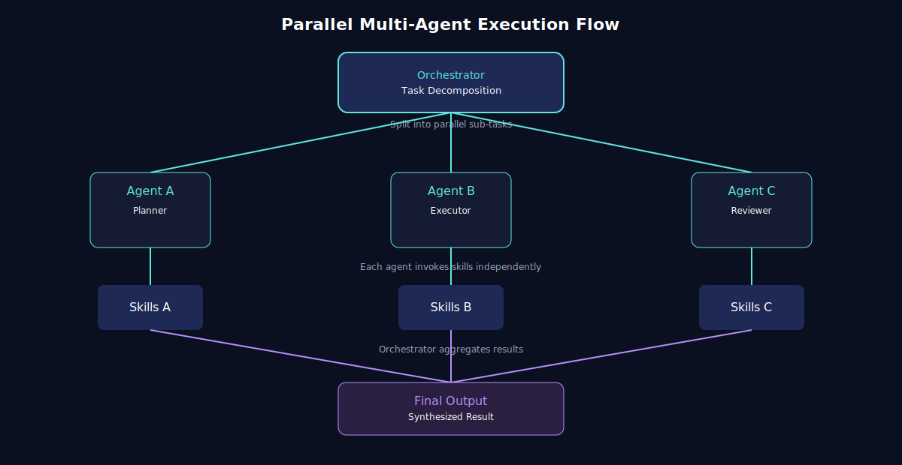
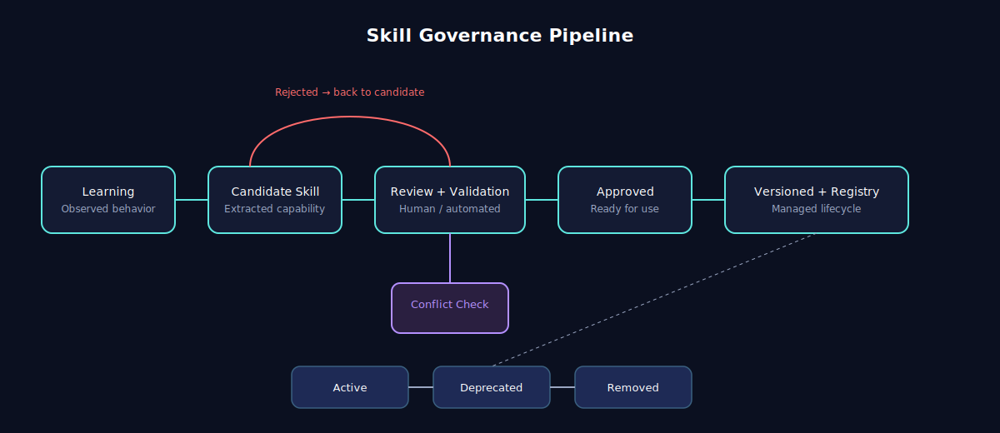

# 🌀 Orqenix

**The control plane for multi-agent AI systems.**

_Orchestrate · Govern · Evolve_

---

## ✨ What is Orqenix

Orqenix is a runtime and control plane for building multi-agent AI systems that are structured, observable, and safely evolvable.

Most teams can run agents. Few can control, scale, and evolve them safely. Orqenix is the layer that solves exactly that.

| Orqenix is                              | Orqenix is not            |
| --------------------------------------- | ------------------------- |
| A control plane for multi-agent systems | A prompt chaining library |
| A governance + orchestration platform   | A single-agent runtime    |
| A knowledge + memory backbone           | Another agent framework   |

## 🧭 Positioning

Orqenix is complementary to existing tools, not a replacement. It sits at a layer most of them skip.

| Layer             | Examples                     | Orqenix Role         |
| ----------------- | ---------------------------- | -------------------- |
| LLM Providers     | OpenAI, Anthropic, local     | Consumed via routing |
| Agent Runtimes    | OpenCode, Claude Code, Codex | Coordinated          |
| Agent Frameworks  | LangGraph, CrewAI, AutoGen   | Complementary        |
| Skill Ecosystems  | Superpowers, oh-my-openagent | Standardized inside  |
| **Control Plane** | **Orqenix**                  | **This is us**       |

## ⚔️ Feature Comparison

| Capability                  | LangGraph | CrewAI | AutoGen | Superpowers | OMO | **Orqenix** |
| --------------------------- | :-------: | :----: | :-----: | :---------: | :-: | :---------: |
| Deterministic orchestration |    ✅     |   ⚠️   |   ❌    |     ❌      | ⚠️  |     ✅      |
| Skill governance            |    ❌     |   ❌   |   ❌    |     ⚠️      | ⚠️  |     ✅      |
| Dynamic model routing       |    ❌     |   ❌   |   ❌    |     ❌      | ✅  |     ✅      |
| Specialized knowledge bases |    ❌     |   ❌   |   ❌    |     ❌      | ⚠️  |     ✅      |
| Context pruning             |    ❌     |   ❌   |   ❌    |     ❌      | ⚠️  |     ✅      |
| Controlled learning loop    |    ❌     |   ❌   |   ❌    |     ❌      | ❌  |     ✅      |
| Runtime-agnostic            |    ⚠️     |   ⚠️   |   ⚠️    |     ❌      | ❌  |     ✅      |
| Observability-first         |    ✅     |   ⚠️   |   ❌    |     ❌      | ⚠️  |     ✅      |

Legend: ✅ first-class · ⚠️ partial · ❌ not supported

## 💥 Pain Points We Solve

| Problem         | Typical Systems         | Orqenix                       |
| --------------- | ----------------------- | ----------------------------- |
| Agent chaos     | Uncontrolled chat loops | Orchestrated execution        |
| Skill explosion | Unmanaged growth        | Versioned + governed registry |
| Cost blowups    | Hardcoded models        | Dynamic routing               |
| Learning drift  | Unverified updates      | Approval pipeline             |
| Token waste     | Full context stuffing   | Pruning + recall              |
| Debugging pain  | Hidden state            | Full traceability             |

---

## 🏗 Architecture

assets/architecture.svgrchitecture" width="100%" />

Orqenix follows a layered design with two cross-cutting concerns (Observability and Governance) that span every component.

📖 Layer breakdown

| Layer             | Responsibility                                            |
| ----------------- | --------------------------------------------------------- |
| Client Layer      | Entry points: applications, developers, CI/CD             |
| Orchestrator Core | Task decomposition, model routing, execution flow         |
| Agents            | Specialized stateless units (Planner, Executor, Reviewer) |
| Skills            | Versioned, reusable capabilities                          |
| Plugins           | Bridges to external systems                               |
| MCP               | Standard protocol for tools and context                   |
| Memory            | Short-term execution + long-term knowledge                |
| Governance        | Approval, conflict detection, versioning, audit           |
| Observability     | Traces, metrics, logs, error tracking                     |

Each layer is independently replaceable, preserving composability and avoiding lock-in.

## ⚙️ Execution Model

Tasks are decomposed and dispatched in parallel across specialized agents. The orchestrator merges results deterministically, avoiding the unbounded chat loops common in conversational frameworks.

📖 Why parallel execution matters

- Each agent runs in isolated context
- Skills are invoked independently per agent
- No cross-agent prompt pollution
- Aggregation is deterministic and reviewable
- Failures are isolated, not cascading

This pattern is what allows Orqenix to scale agent count without scaling chaos.

## 💬 Agent Communication

assets/agent-communication.svgent Communication" width="100%" />

Agents do not converse freely. The orchestrator owns the communication graph, and peer-to-peer paths are opt-in and bounded.

📖 Why this matters

Conversational frameworks (such as AutoGen) suffer from:

- Unpredictable termination
- Hard-to-audit reasoning traces
- Token cost explosion via repeated debate

Orqenix replaces emergent conversation with designed coordination, keeping the system auditable and bounded.

## 🧠 Dynamic Model Routing

assets/model-routing.svgodel Routing" width="100%" />

Every task is routed at runtime to the most appropriate model, based on complexity, cost budget, latency, and task type.

📖 How routing decisions are made

| Signal     | Influence                      |
| ---------- | ------------------------------ |
| Complexity | Reasoning power required       |
| Budget     | Cost ceiling per task          |
| Latency    | Response time targets          |
| Task type  | Match model capability profile |

Routing is deterministic, observable, and overridable per skill. This avoids the common pattern of hardcoding expensive models for every sub-task.

## 📚 Knowledge Base System

assets/kb-system.svgB System" width="100%" />

Orqenix splits knowledge into three specialized KBs, each with its own chunking, compression, and recall strategy. The session never receives raw data, only distilled knowledge.

📖 The three KBs

| KB             | Stores                          | Used For                 |
| -------------- | ------------------------------- | ------------------------ |
| **DocsKB**     | Specs, RFCs, READMEs, ADRs      | Domain and system intent |
| **CodeKB**     | Source, AST, symbols, tests     | Implementation awareness |
| **DecisionKB** | Trade-offs, rationale, outcomes | Consistency over time    |

📖 Ingestion pipeline

| Stage    | Description                                |
| -------- | ------------------------------------------ |
| Chunk    | Split into semantically meaningful units   |
| Embed    | Generate vector representation             |
| Compress | Summarize and remove redundancy            |
| Index    | Store with metadata (tags, version, scope) |

Each KB tunes the pipeline differently:

| KB         | Chunking        | Compression                    |
| ---------- | --------------- | ------------------------------ |
| DocsKB     | Section-based   | Summarization                  |
| CodeKB     | Symbol-based    | Signature + intent extraction  |
| DecisionKB | Decision record | Context + outcome distillation |

📖 Session recall flow

1. Smart Retriever detects task type
2. Routes query to the relevant KB(s)
3. Compressor reduces to high-signal content
4. Context Injector delivers minimal context into the session
5. Outcomes feed back into DecisionKB

Memory holds the present. Knowledge holds the past. Decisions shape the future.

## 🛡 Governance Pipeline

Every new capability flows through a controlled pipeline: learning, candidate, review, approval, versioning. Orqenix never auto-promotes a skill into the active registry.

📖 Governance in detail

| Stage          | Purpose                             |
| -------------- | ----------------------------------- |
| Observation    | Capture execution patterns          |
| Candidate      | Extract reusable capability         |
| Review         | Human or automated validation       |
| Conflict Check | Detect overlap with existing skills |
| Approval       | Promote into registry               |
| Versioning     | Manage lifecycle and rollback       |

This is the layer that prevents silent quality degradation as the system grows.

## 🔁 Skill Lifecycle

assets/skill-lifecycle.svgkill Lifecycle" width="100%" />

Skills move through clear states with explicit transitions. Nothing enters production without passing review.

📖 Lifecycle states

| State      | Meaning                        |
| ---------- | ------------------------------ |
| Draft      | Proposed, not yet validated    |
| Review     | Under evaluation               |
| Approved   | Validated and signed off       |
| Versioned  | Released into registry         |
| Deprecated | Replaced or retired            |
| Removed    | Fully removed with audit trail |

## 🔄 Execution Sequence

assets/sequence.svg" alt="Execution Sequence" width="100%" />

A clean, observable pipeline from request to response. Each step is traceable and replayable.

📖 What happens at each step

1. Client submits a task
2. Orchestrator selects and assigns agents
3. Agents invoke skills as needed
4. Skills call into MCP for context and tools
5. MCP pulls from memory and routes to LLM
6. Results bubble back through the chain
7. Orchestrator synthesizes the final response

## 🌐 System Lifecycle

assets/system-lifecycle.svgstem Lifecycle" width="100%" />

The full closed loop: execute, observe, learn, validate, promote, reuse. This is what turns Orqenix from a runtime into a system that improves itself, safely.

📖 Why this loop matters

Most agent stacks stop at execution. Orqenix closes the loop with governance and knowledge persistence, so every execution strengthens the system rather than producing throwaway output.

| Step     | Effect                   |
| -------- | ------------------------ |
| Execute  | Produce result           |
| Observe  | Capture signal           |
| Learn    | Generate candidate skill |
| Validate | Govern quality           |
| Promote  | Register safely          |
| Reuse    | Apply on next task       |

---

## 🚀 Roadmap

Phase-based, not time-based.

| Phase | Theme                  | Key Outcomes                                     |
| ----- | ---------------------- | ------------------------------------------------ |
| 1     | Foundation Runtime     | Orchestrator loop, agent abstraction, MCP basics |
| 2     | Skill System           | Registry, execution pipeline, discovery          |
| 3     | Governance             | Approval workflow, conflict detection, rollback  |
| 4     | Advanced Orchestration | Dynamic routing, parallel execution              |
| 5     | Plugin Ecosystem       | External integrations, secure execution          |
| 6     | Learning Loop          | Observation, candidate, validation, promotion    |
| 7     | Organization Layer     | Agent teams, roles, delegation                   |
| 8     | Platformization        | UI, dashboards, deployment models                |

## 🤝 Contributing

We are building Orqenix for long-term system design, not quick hacks. Contributions are welcome from anyone aligned with these principles.

| Principle     | Meaning                         |
| ------------- | ------------------------------- |
| Deterministic | Predictable, traceable behavior |
| Composable    | Small, replaceable parts        |
| Governed      | Capabilities are reviewable     |
| Cost-aware    | Efficiency is first-class       |
| Observable    | No hidden behavior              |

📖 Contribution workflow

| Step | Action                                                 |
| ---- | ------------------------------------------------------ |
| 1    | Open an issue for non-trivial work                     |
| 2    | Fork and branch (`feature/...`, `fix/...`, `docs/...`) |
| 3    | Keep changes scoped, documented, tested                |
| 4    | Open a PR with problem, approach, and trade-offs       |
| 5    | Pass review focused on alignment with principles       |

📖 Contribution types

| Type          | Examples                                   |
| ------------- | ------------------------------------------ |
| Code          | Orchestrator, agents, skills, plugins, MCP |
| Design        | RFCs, architecture proposals, skill spec   |
| Documentation | Concepts, tutorials, diagrams              |
| Quality       | Tests, benchmarks, bug reports             |

📖 Quality bar

| Requirement   | Standard                            |
| ------------- | ----------------------------------- |
| Determinism   | No hidden non-determinism           |
| Traceability  | Observable execution paths          |
| Compatibility | Migration path for breaking changes |
| Documentation | Required for new concepts           |
| Tests         | Required on critical paths          |

📖 Priority right now

| Priority  | Area                                     |
| --------- | ---------------------------------------- |
| 🔴 High   | Orchestrator core, skill spec, KB schema |
| 🟡 Medium | Governance, routing, observability       |
| 🟢 Open   | Docs, examples, integrations             |

📖 RFC template

| Section           | Purpose                       |
| ----------------- | ----------------------------- |
| Problem           | What is broken or missing     |
| Goals / Non-goals | Scope boundaries              |
| Design            | Proposed approach             |
| Alternatives      | What else was considered      |
| Risks             | Trade-offs and unknowns       |
| Impact            | Effect on existing components |

📖 Code of Conduct

| Do                             | Don't                           |
| ------------------------------ | ------------------------------- |
| Be respectful and constructive | Harass or attack individuals    |
| Focus on ideas                 | Be hostile in disagreement      |
| Assume good intent             | Make assumptions about identity |

## 📌 Status

| Area                   | Status         |
| ---------------------- | -------------- |
| Vision and principles  | ✅ Stable      |
| Architectural concepts | ✅ Defined     |
| Orchestrator core      | 🚧 In progress |
| Skill system           | 🚧 In progress |
| KB system              | 🚧 In progress |
| Governance layer       | 🔜 Planned     |
| Plugin ecosystem       | 🔜 Planned     |
| Learning loop          | 🔜 Planned     |
| Platformization        | 🔜 Planned     |

## ✅ Summary

Orqenix solves the real bottleneck of modern AI systems.

Not intelligence. **Coordination, knowledge, and controlled evolution.**

Built to scale agents. Designed to control them. Engineered to evolve safely.
