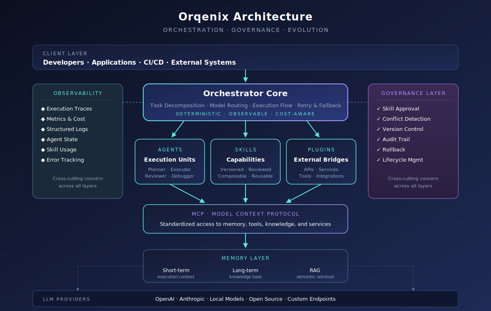

**A structured runtime and control plane for multi-agent AI systems.**

## 📖 Contents

| Section | Section |
|---|---|
| #-overview | #-positioning |
| #-vision--mission | #-comparison |
| #-pain-points | #-roadmap |
| #-core-concepts | #-contributing |
| #-architecture | #-status |

---

## 🌐 Overview

Orqenix is an **AI orchestration platform** for composing, governing, and evolving multi-agent systems.

| Aspect | Description |
|---|---|
| **What it is** | A runtime and control plane for multi-agent AI |
| **What it solves** | Coordination, governance, controlled evolution |
| **Who it's for** | Teams building serious multi-agent systems |
| **What it isn't** | Another single-agent framework |

> Orqenix turns chaotic agent experimentation into engineered, reviewable, maintainable systems.

---

## 🎯 Vision & Mission

| Vision | Mission |
|---|---|
| A control plane where multi-agent systems can be composed, governed, and evolved safely at scale. | Provide deterministic orchestration, standardized skills, safe evolution, and cost-aware execution, while staying framework-agnostic. |

---

## 💥 Pain Points

| # | Pain Point | Orqenix Response |
|---|---|---|
| 1 | Uncontrolled skill growth | Skill registry, versioning, conflict detection |
| 2 | Hidden coordination logic | Explicit orchestration with full traceability |
| 3 | Cost blowups | Dynamic per-task model routing |
| 4 | Ungoverned learning | Review → validate → promote workflow |
| 5 | Fragmented memory | Unified MCP-based memory layer |
| 6 | Vendor lock-in | Plugin and MCP abstractions |
| 7 | Mixed concerns | Strict separation: Agent vs Skill vs Plugin vs MCP |

---

## 🧠 Core Concepts

| Concept | Role |
|---|---|
| **Orchestrator** | Decomposes tasks, routes models, manages execution |
| **Agents** | Specialized, stateless, composable execution units |
| **Skills** | Versioned, reviewable, reusable capabilities |
| **Plugins** | Bridge agents to external systems |
| **MCP** | Standard protocol for memory and tool access |
| **Memory** | Short-term + long-term + RAG retrieval |
| **Governance** | Approval, conflict detection, rollback, audit |

---

## 🏗 Architecture

### Layer Responsibilities

| Layer | Responsibility |
|---|---|
| **Client Layer** | Entry points: developers, applications, CI/CD, external systems |
| **Orchestrator Core** | Task decomposition, model routing, execution flow control |
| **Agents** | Specialized execution units (Planner, Executor, Reviewer, Debugger) |
| **Skills** | Versioned, reviewable, reusable capabilities |
| **Plugins** | External bridges to APIs, services, and tools |
| **MCP** | Standardized protocol for memory and tool access |
| **Memory Layer** | Short-term context, long-term knowledge, RAG retrieval |
| **LLM Providers** | Backend models consumed via dynamic routing |
| **Governance** | Cross-cutting: approval, conflict detection, versioning, audit |
| **Observability** | Cross-cutting: traces, metrics, logs, error tracking |

### Design Principles

| Principle | Meaning |
|---|---|
| Deterministic | Predictable, traceable behavior |
| Composable | Small, replaceable parts |
| Governed | Capabilities are reviewable |
| Cost-aware | Efficiency is a first-class concern |
| Separated | Clear boundaries across layers |
| Observable | No hidden behavior |

---

## 🧭 Positioning

| Layer | Examples | Orqenix Role |
|---|---|---|
| LLM Providers | OpenAI, Anthropic, local models | Consumed via routing |
| Agent Runtimes | OpenCode, Claude Code, Codex | Coordinated |
| Agent Frameworks | LangGraph, CrewAI, AutoGen | Complementary |
| Skill Ecosystems | Superpowers, oh-my-openagent | Standardized inside |
| **Control Plane** | **Orqenix** | **Where Orqenix lives** |

---

## ⚔️ Comparison

| Solution | Strength | Gap Orqenix Fills |
|---|---|---|
| **LangGraph** | Graph-based deterministic workflows 【1-9c9683】 | No skill system, governance, or evolution |
| **CrewAI** | Fast prototyping, role-based teams【1-9c9683】 | Lacks fine-grained control and governance |
| **AutoGen / MS Agent Framework** | Conversational collaboration【2-f3a6dc】 | Hard to audit, hard to terminate |
| **Superpowers** | Skills as composable files【3-a1e6b7】 | Single-agent methodology only |
| **OMO / OpenCode Orchestrator** | Multi-model harness 【4-2ced76】【5-c576ca】 | Tied to one runtime |
| **Claude Squad / Conductor / Astro** | Parallel coding execution【6-99ed01】【7-4ac0e9】 | No governance, no platform layer |

### Where Orqenix Uniquely Sits

| Others optimize for | Orqenix optimizes for |
|---|---|
| Workflow control | Multi-agent orchestration |
| Role-based prototyping | Skill and plugin governance |
| Conversational collaboration | Controlled evolution |
| Single-runtime extension | Runtime-agnostic composition |
| Parallel execution | Platform-level discipline |

---

## 🚀 Roadmap

> Phase-based, not time-based.

| Phase | Theme | Key Outcomes |
|---|---|---|
| **1. Foundation Runtime** | Stable orchestration core | Orchestrator loop, agent abstraction, MCP basics |
| **2. Skill System** | Standardized capabilities | Skill registry, execution pipeline, discovery |
| **3. Governance** | Controlled evolution | Approval workflow, conflict detection, rollback |
| **4. Advanced Orchestration** | Performance & cost | Dynamic model routing, parallel execution |
| **5. Plugin Ecosystem** | Real-world integration | Plugin interface, secure execution |
| **6. Learning Loop** | Safe self-improvement | Observation → candidate → validation → promotion |
| **7. Organization Layer** | Teams of agents | Roles, hierarchies, delegation |
| **8. Platformization** | Full platform maturity | UI, dashboards, import/export, deployment |

---

## 🤝 Contributing

Orqenix is in an early architectural phase. Contributions are welcome, but must align with the project's principles.

### Contribution Types

| Type | Examples |
|---|---|
| **Code** | Orchestrator, agents, skills, plugins, MCP, observability |
| **Design** | RFCs, architecture proposals, skill spec refinements |
| **Documentation** | Concepts, tutorials, diagrams, patterns |
| **Quality** | Tests, benchmarks, reproductions, bug reports |

### Workflow

| Step | Action |
|---|---|
| 1 | Open an issue first for non-trivial work |
| 2 | Fork and create a clear branch (`feature/...`, `fix/...`, `docs/...`) |
| 3 | Keep changes scoped, documented, and tested |
| 4 | Open a PR with problem, approach, trade-offs, evidence |
| 5 | Pass review focused on alignment with principles |

### Quality Bar

| Requirement | Standard |
|---|---|
| Determinism | No hidden non-determinism |
| Traceability | Observable execution paths |
| Compatibility | Migration path for breaking changes |
| Documentation | Required for new concepts |
| Tests | Required on critical paths |

### Working on Skills

| Step | Description |
|---|---|
| Draft | Define scope, boundaries, conflicts |
| Review | Maintainer + automated checks |
| Approved | Versioned and promoted |
| Deprecated | Replaced or removed with audit trail |

### Working on the Orchestrator Core

| Requirement | Reason |
|---|---|
| No hidden control flow | Predictability |
| Observability hooks | Debuggability |
| Clean extension points | Long-term composability |
| Design proposal required | Sensitive surface area |

### RFC Template

| Section | Purpose |
|---|---|
| Problem | What is broken or missing |
| Goals / Non-goals | Scope boundaries |
| Design | Proposed approach |
| Alternatives | What else was considered |
| Risks | Trade-offs and unknowns |
| Impact | Effect on existing components |

### Code of Conduct

| Do | Don't |
|---|---|
| Be respectful, constructive, async | Harass, discriminate, attack individuals |
| Focus on ideas | Be hostile in disagreement |
| Assume good intent | Make assumptions about identity |

### What We Need Right Now

| Priority | Area |
|---|---|
| 🔴 High | Architectural feedback, skill spec refinement |
| 🟡 Medium | Orchestrator core foundations, documentation |
| 🟢 Open | Reference implementations, tests, examples |

---

## 📌 Status

| Area | Status |
|---|---|
| Vision and principles | ✅ Stable |
| Architectural concepts | ✅ Defined |
| Orchestrator core | 🚧 In progress |
| Skill system | 🚧 In progress |
| Governance layer | 🔜 Planned |
| Plugin ecosystem | 🔜 Planned |
| Learning loop | 🔜 Planned |
| Platformization | 🔜 Planned |

---

**Orqenix · Built to last. Designed to evolve. Governed by principle.**
