<p align="center">
  
</p>

<h1 align="center">Orqenix</h1>
<p align="center">
  <strong>The local-first knowledge fabric for multi-project AI development.</strong>
</p>
<p align="center">
  Mesh-linked scopes, capability-based permissions, polyglot knowledge graphs,<br/>
  and compress-as-memorize semantics, all running on your machine.
</p>

<p align="center">
  <a href="https://www.npmjs.com/package/@orqenix/core"></a>
  <a href="https://www.npmjs.com/package/@orqenix/mesh-transport-core"></a>
  <a href="https://www.npmjs.com/package/@orqenix-pro/cli"></a>
  <a href="https://github.com/milosaysyolo/Orqenix/actions/workflows/ci.yml"></a>
  <a href="https://github.com/milosaysyolo/Orqenix/blob/main/LICENSE"></a>
  <a href="https://github.com/milosaysyolo/Orqenix-Pro/blob/main/LICENSE"></a>
  <a href="https://nodejs.org"></a>
</p>

<p align="center">
  <a href="https://github.com/milosaysyolo/Orqenix/discussions"></a>
  <a href="<!-- TBD: discord-invite -->"></a>
  <a href="https://x.com/<!-- TBD: twitter-handle -->"></a>
  <a href="https://github.com/milosaysyolo/Orqenix/stargazers"></a>
</p>

---

## What is Orqenix?

> **Local-first knowledge fabric + control plane for multi-agent AI systems.**
>
> Orqenix gives AI coding agents durable memory, project-aware knowledge, deterministic orchestration, governed skill execution, and local-first cross-repository context without forcing you into a hosted agent platform.

Orqenix is built for teams and individuals who already use AI coding agents but need the missing control layer around them: memory that persists, knowledge that can be queried with provenance, skills that can be governed, agent work that can be observed, and project boundaries that remain local-first and capability-scoped.

It is not "another agent framework." It is the **knowledge fabric and control plane** around agents, tools, repositories, branches, sessions, skills, plugins, and workspaces.

---

## Table of contents

- [What Orqenix is](#what-orqenix-is)
- [Product positioning](#product-positioning)
- [Why Orqenix exists](#why-orqenix-exists)
- [Design principles](#design-principles)
- [Architecture at a glance](#architecture-at-a-glance)
- [Core visual model](#core-visual-model)
- [Knowledge fabric](#knowledge-fabric)
- [Control plane](#control-plane)
- [Local-first mesh](#local-first-mesh)
- [Workbench](#workbench)
- [Methodology](#methodology)
- [Quick start](#quick-start)
- [Installation](#installation)
- [CLI guide](#cli-guide)
- [Repository and storage layout](#repository-and-storage-layout)
- [Packages](#packages)
- [Configuration](#configuration)
- [Security and governance](#security-and-governance)
- [Lifecycle and detach](#lifecycle-and-detach)
- [Testing and verification](#testing-and-verification)
- [Roadmap](#roadmap)
- [License](#license)
- [FAQ](#faq)

---

## What Orqenix is

Orqenix is a **local-first knowledge fabric and control plane** for multi-agent AI systems.

That phrase is deliberate:

- **Local-first** means your project memory, knowledge indexes, audit trails, scope identities, and mesh links are designed to live beside your code before they depend on a hosted service.
- **Knowledge fabric** means Orqenix connects documents, source code, decisions, sessions, branches, plugins, and agent work into queryable project knowledge with provenance.
- **Control plane** means Orqenix governs how agents, skills, tools, plugins, memory, and cross-scope context are discovered, invoked, routed, audited, and evolved.
- **Multi-agent AI systems** means Orqenix is built for more than one chat loop. It is for coordinated agent teams, repeatable workflows, verifiable memory, and bounded autonomy.

### One-sentence summary

**Orqenix lets agents remember, reason across repositories, use governed skills, and operate inside a deterministic, auditable orchestration layer while keeping project knowledge local-first.**

---

## Product positioning

### Orqenix in the AI tooling stack

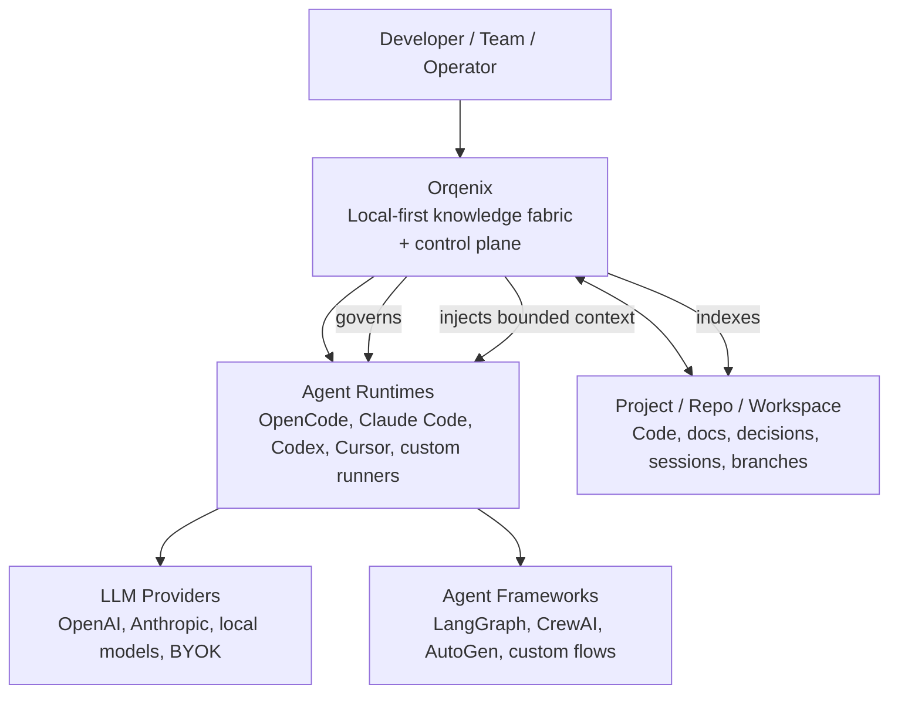
```mermaid
flowchart TB
  Provider[LLM Providers<br/>OpenAI, Anthropic, local models, BYOK]
  Runtime[Agent Runtimes<br/>OpenCode, Claude Code, Codex, Cursor, custom runners]
  Framework[Agent Frameworks<br/>LangGraph, CrewAI, AutoGen, custom flows]
  Orqenix[Orqenix<br/>Local-first knowledge fabric<br/>+ control plane]
  Project[Project / Repo / Workspace<br/>Code, docs, decisions, sessions, branches]
  Human[Developer / Team / Operator]

  Human --> Orqenix
  Orqenix --> Runtime
  Runtime --> Provider
  Runtime --> Framework
  Orqenix <--> Project
  Orqenix -->|governs| Runtime
  Orqenix -->|indexes| Project
  Orqenix -->|injects bounded context| Runtime
```

Orqenix is complementary to existing AI coding tools. It is the layer that gives them project memory, structured knowledge, governed skill usage, cross-repo context, release-aware workflows, auditability, and policy boundaries.

### What Orqenix is and is not

| Orqenix is | Orqenix is not |
| --- | --- |
| A local-first knowledge fabric for AI coding work | A cloud-only memory service |
| A control plane for multi-agent systems | A single-agent runtime |
| A governance and orchestration layer | A prompt-chaining helper |
| A memory + knowledge backbone | A raw vector database wrapper |
| A mesh model for multi-project context | A centralized SaaS dependency by default |
| A runtime-agnostic coordinator | A replacement for every editor, model, or framework |
| A package, plugin, skill, and lifecycle system | A loose pile of scripts |

### The unified product thesis

Agents are becoming easier to run, but harder to control.

The missing layer is not another chat loop. The missing layer is a system that answers:

1. **What does the agent know?**
2. **Where did that knowledge come from?**
3. **Which project, branch, session, and decision does it belong to?**
4. **Which skills and plugins may be used?**
5. **What changed after the agent acted?**
6. **Can another project safely reuse this context?**
7. **Can the whole system be detached, audited, upgraded, and restored?**

Orqenix is built around those questions.

---

## Why Orqenix exists

Most AI coding environments begin with a useful agent and then accumulate hidden complexity:

| Pain point | Typical failure mode | Orqenix response |
| --- | --- | --- |
| Agents forget | Decisions, architecture, and branch history disappear between sessions. | Persistent memory tiers, DecisionKB, ChatKB, branch/session records, recall flows. |
| Context gets stuffed | Tools dump raw docs, source files, logs, and chat into prompts. | Knowledge indexes, compression, distillation, context assembly, token budgets. |
| Multi-agent work becomes chaotic | Agents debate, loop, overwrite, and lose ownership boundaries. | Orchestrator-owned routing, deterministic aggregation, agent/team contracts. |
| Skills grow without governance | Useful prompts and tools become unversioned folklore. | Skill manifests, registries, marketplace, lifecycle, verification tiers. |
| Cross-repo context is unsafe | One repo blindly reads another repo or leaks private memory. | Scope identity, mesh links, share policy, capability tokens, provenance. |
| Debugging is opaque | You cannot reconstruct why an agent made a change. | Audit logs, decision entries, traces, event streams, Workbench observability. |
| Releases drift | Branch reports, npm packages, GitHub releases, and docs disagree. | Evidence ladder, verification reports, release convergence discipline. |
| Detach is risky | AI tooling writes hidden files and cannot clean itself up. | Touched-file ledger, fenced blocks, snapshots, archives, `orqenix detach`. |

---

## Design principles

### 1. Local-first before cloud-first

Orqenix should work inside a local repository and local workspace before it depends on remote infrastructure. Remote sync, hosted services, and cloud collaboration can be added, but they should not be the root assumption.

### 2. Knowledge must have provenance

A retrieved fact without provenance is not safe context. Orqenix treats knowledge as scoped, timestamped, source-linked, and permission-checked.

### 3. Agents should be coordinated, not left to free-form chat

Agent-to-agent conversation is bounded. The orchestrator owns the graph, the hooks, the policy, and the merge strategy.

### 4. Memory should be structured, not a transcript dump

Raw transcripts are expensive and brittle. Orqenix uses memory tiers, knowledge types, distillation, branch/session metadata, and recall paths.

### 5. Every cross-scope operation is a permissioned operation

A mesh link is not a blanket trust relationship. Scope identity, declared links, share policy, and capability tokens define what is allowed.

### 6. Detachability is a product feature

A tool that cannot remove itself cleanly becomes project debt. Orqenix treats detach, archive, restore, and purge as first-class lifecycle operations.

---

## Architecture at a glance

### Six-layer architecture

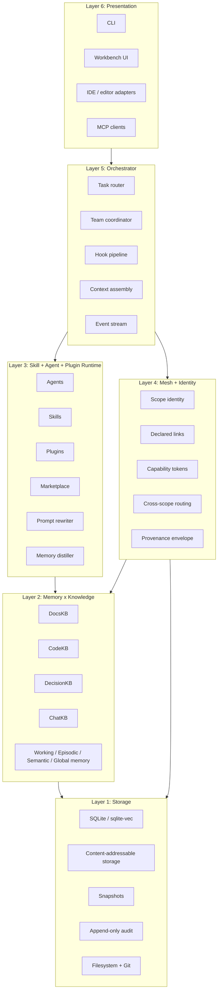
```mermaid
flowchart TB
  subgraph L6[Layer 6: Presentation]
    CLI[CLI]
    WB[Workbench UI]
    IDE[IDE / editor adapters]
    MCPClient[MCP clients]
  end

  subgraph L5[Layer 5: Orchestrator]
    Router[Task router]
    Teams[Team coordinator]
    Hooks[Hook pipeline]
    Context[Context assembly]
    Events[Event stream]
  end

  subgraph L4[Layer 4: Mesh + Identity]
    ScopeID[Scope identity]
    Links[Declared links]
    Tokens[Capability tokens]
    MeshRouter[Cross-scope routing]
    Provenance[Provenance envelope]
  end

  subgraph L3[Layer 3: Skill + Agent + Plugin Runtime]
    Agents[Agents]
    Skills[Skills]
    Plugins[Plugins]
    Marketplace[Marketplace]
    Rewriter[Prompt rewriter]
    Distiller[Memory distiller]
  end

  subgraph L2[Layer 2: Memory x Knowledge]
    DocsKB[DocsKB]
    CodeKB[CodeKB]
    DecisionKB[DecisionKB]
    ChatKB[ChatKB]
    Memory[Working / Episodic / Semantic / Global memory]
  end

  subgraph L1[Layer 1: Storage]
    SQLite[SQLite / sqlite-vec]
    CAS[Content-addressable storage]
    Snapshots[Snapshots]
    Audit[Append-only audit]
    FS[Filesystem + Git]
  end

  L6 --> L5
  L5 --> L4
  L5 --> L3
  L3 --> L2
  L4 --> L2
  L2 --> L1
  L4 --> L1
```

### Cross-cutting concerns

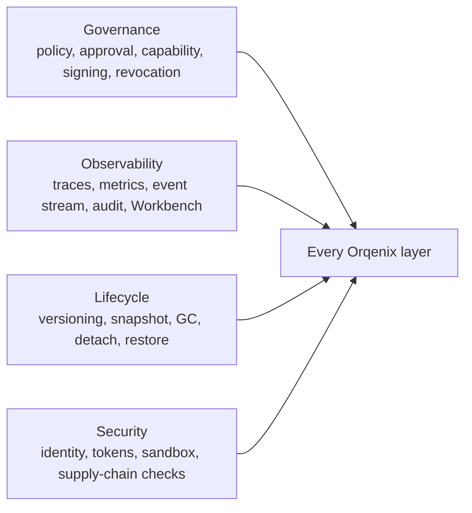
```mermaid
flowchart LR
  Governance[Governance<br/>policy, approval, capability, signing, revocation]
  Observability[Observability<br/>traces, metrics, event stream, audit, Workbench]
  Lifecycle[Lifecycle<br/>versioning, snapshot, GC, detach, restore]
  Security[Security<br/>identity, tokens, sandbox, supply-chain checks]

  Governance --> All[Every Orqenix layer]
  Observability --> All
  Lifecycle --> All
  Security --> All
```

### Runtime topology

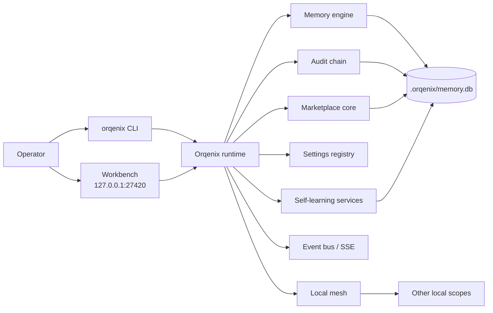
```mermaid
flowchart LR
  User[Operator] --> CLI[orqenix CLI]
  User --> Workbench[Workbench<br/>127.0.0.1:27420]
  CLI --> Runtime[Orqenix runtime]
  Workbench --> Runtime
  Runtime --> MemoryEngine[Memory engine]
  Runtime --> MarketplaceCore[Marketplace core]
  Runtime --> SelfLearning[Self-learning services]
  Runtime --> Settings[Settings registry]
  Runtime --> AuditChain[Audit chain]
  Runtime --> EventBus[Event bus / SSE]
  Runtime --> Mesh[Local mesh]
  MemoryEngine --> DB[(.orqenix/memory.db)]
  AuditChain --> DB
  MarketplaceCore --> DB
  SelfLearning --> DB
  Mesh --> OtherScopes[Other local scopes]
```

---

## Core visual model

### The shortest mental model

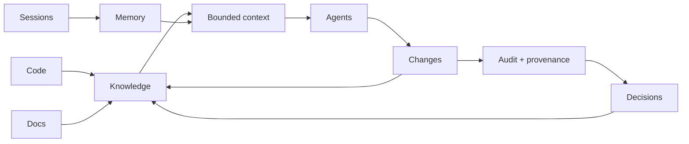
```mermaid
flowchart LR
  Code[Code] --> Knowledge[Knowledge]
  Docs[Docs] --> Knowledge
  Decisions[Decisions] --> Knowledge
  Sessions[Sessions] --> Memory[Memory]
  Knowledge --> Context[Bounded context]
  Memory --> Context
  Context --> Agents[Agents]
  Agents --> Changes[Changes]
  Changes --> Audit[Audit + provenance]
  Audit --> Decisions
  Changes --> Knowledge
```

### Orqenix as a control loop

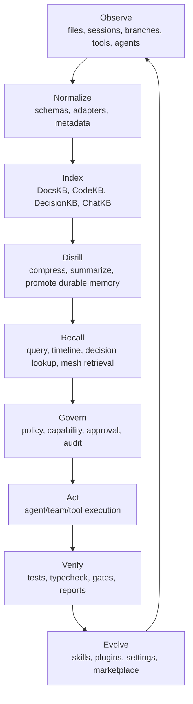
```mermaid
flowchart TB
  Observe[Observe<br/>files, sessions, branches, tools, agents]
  Normalize[Normalize<br/>schemas, adapters, metadata]
  Index[Index<br/>DocsKB, CodeKB, DecisionKB, ChatKB]
  Distill[Distill<br/>compress, summarize, promote durable memory]
  Recall[Recall<br/>query, timeline, decision lookup, mesh retrieval]
  Govern[Govern<br/>policy, capability, approval, audit]
  Act[Act<br/>agent/team/tool execution]
  Verify[Verify<br/>tests, typecheck, gates, reports]
  Evolve[Evolve<br/>skills, plugins, settings, marketplace]

  Observe --> Normalize --> Index --> Distill --> Recall --> Govern --> Act --> Verify --> Evolve --> Observe
```

### Knowledge fabric graph

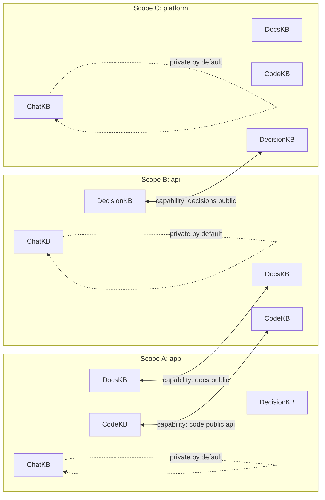
```mermaid
flowchart LR
  subgraph ScopeA[Scope A: app]
    ADocs[DocsKB]
    ACode[CodeKB]
    ADecisions[DecisionKB]
    AChat[ChatKB]
  end

  subgraph ScopeB[Scope B: api]
    BDocs[DocsKB]
    BCode[CodeKB]
    BDecisions[DecisionKB]
    BChat[ChatKB]
  end

  subgraph ScopeC[Scope C: platform]
    CDocs[DocsKB]
    CCode[CodeKB]
    CDecisions[DecisionKB]
    CChat[ChatKB]
  end

  ACode <-->|capability: code public api| BCode
  ADocs <-->|capability: docs public| BDocs
  BDecisions <-->|capability: decisions public| CDecisions
  AChat -. private by default .-> AChat
  BChat -. private by default .-> BChat
  CChat -. private by default .-> CChat
```

### Methodology: from evidence to canonical release

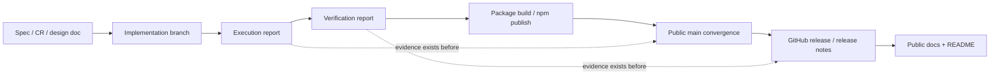
```mermaid
flowchart LR
  Spec[Spec / CR / design doc]
  Branch[Implementation branch]
  Report[Execution report]
  Verify[Verification report]
  Package[Package build / npm publish]
  Main[Public main convergence]
  Release[GitHub release / release notes]
  Docs[Public docs + README]

  Spec --> Branch --> Report --> Verify --> Package --> Main --> Release --> Docs

  Report -. evidence exists before .-> Main
  Verify -. evidence exists before .-> Release
```

---

## Knowledge fabric

The knowledge fabric is the part of Orqenix that turns a repository or workspace into structured, queryable, provenance-aware memory for agents.

### Knowledge types

| Knowledge type | Stores | Query pattern | Why it exists |
| --- | --- | --- | --- |
| **DocsKB** | README files, specs, RFCs, ADRs, architecture docs, release notes | Semantic and metadata search | Captures product intent and design rationale that code alone cannot show. |
| **CodeKB** | Source files, AST symbols, exports, tests, package metadata | Symbol lookup, graph traversal, hybrid search | Gives agents implementation awareness without dumping entire files into context. |
| **DecisionKB** | Decisions, trade-offs, rejected alternatives, outcomes | Decision lookup, ancestor traversal, rationale search | Prevents agents from reversing past decisions without evidence. |
| **ChatKB** | Session summaries, branch conversations, diff-only memory, operator instructions | Timeline, session recall, bug-loop recall | Converts transient agent sessions into durable project memory. |

### Memory tiers

| Tier | Scope | Lifetime | Example |
| --- | --- | --- | --- |
| **Working** | Current task/session | Short | Active files, immediate goal, temporary scratch state. |
| **Episodic** | Session/branch timeline | Medium | "During the auth refactor, the agent found stale token handling." |
| **Semantic** | Stable project knowledge | Long | "Capability tokens are non-delegatable by default." |
| **Global** | Cross-project reusable knowledge | Long, controlled | Team defaults, reusable skill policy, organization-wide conventions. |

### Memory x Knowledge matrix

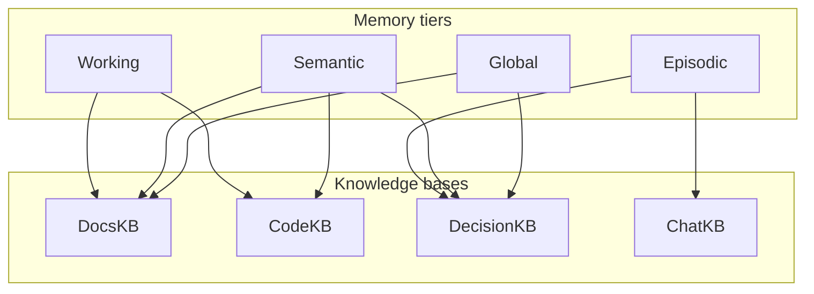
```mermaid
flowchart TB
  subgraph Tiers[Memory tiers]
    W[Working]
    E[Episodic]
    S[Semantic]
    G[Global]
  end

  subgraph KBs[Knowledge bases]
    D[DocsKB]
    C[CodeKB]
    R[DecisionKB]
    H[ChatKB]
  end

  W --> D
  W --> C
  E --> H
  E --> R
  S --> D
  S --> C
  S --> R
  G --> D
  G --> R
```

### Query and context assembly

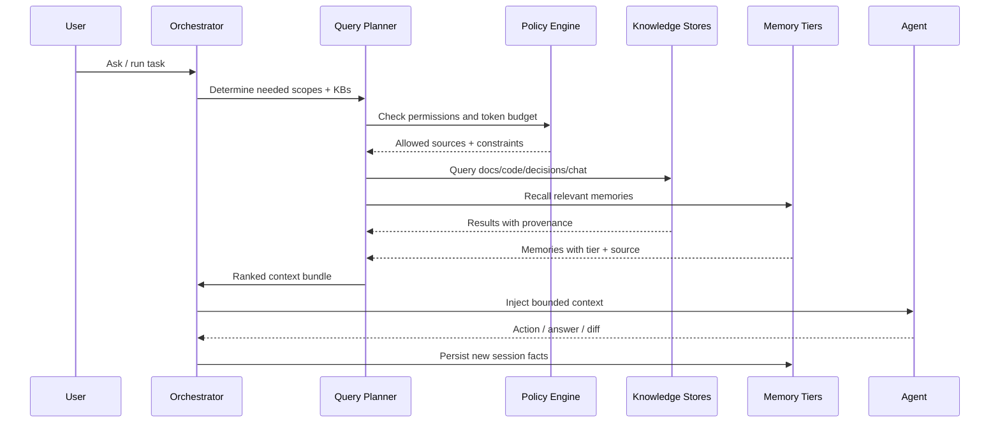
```mermaid
sequenceDiagram
  participant User
  participant Orchestrator
  participant Planner as Query Planner
  participant Policy as Policy Engine
  participant KB as Knowledge Stores
  participant Memory as Memory Tiers
  participant Agent

  User->>Orchestrator: Ask / run task
  Orchestrator->>Planner: Determine needed scopes + KBs
  Planner->>Policy: Check permissions and token budget
  Policy-->>Planner: Allowed sources + constraints
  Planner->>KB: Query docs/code/decisions/chat
  Planner->>Memory: Recall relevant memories
  KB-->>Planner: Results with provenance
  Memory-->>Planner: Memories with tier + source
  Planner->>Orchestrator: Ranked context bundle
  Orchestrator->>Agent: Inject bounded context
  Agent-->>Orchestrator: Action / answer / diff
  Orchestrator->>Memory: Persist new session facts
```

### Why this matters

Without a knowledge fabric, an agent usually has two bad options: guess from stale prompt memory, or load too much raw context. Orqenix provides a third path: **retrieve only the relevant knowledge, with provenance, within a governed token budget.**

---

## Control plane

The control plane is the part of Orqenix that manages execution.

### Control plane responsibilities

| Area | Responsibility |
| --- | --- |
| Routing | Choose model, agent, team, skill, provider, and context strategy. |
| Governance | Enforce policy before tools, skills, plugins, cross-scope reads, and destructive actions. |
| Observability | Emit events, traces, audit entries, dashboards, and verification reports. |
| Lifecycle | Track generated artifacts, indexes, memory, snapshots, trash, and detach archives. |
| Marketplace | Install, verify, update, fork, export, and remove plugins/skills. |
| Security | Manage identities, capability tokens, signatures, revocation, and sandbox rules. |
| Release discipline | Separate evidence, branch status, npm status, GitHub main status, and GitHub release status. |

### Agent execution graph

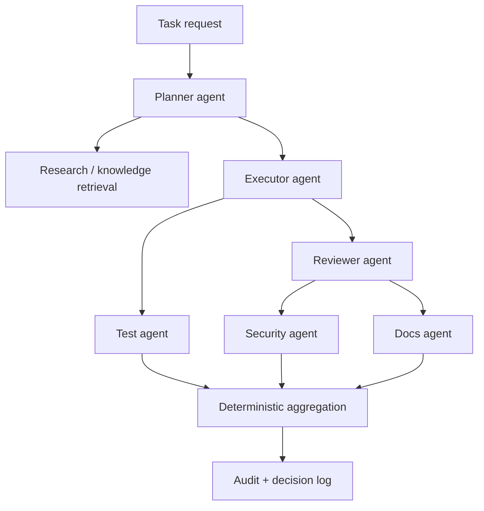
```mermaid
flowchart TB
  Task[Task request]
  Plan[Planner agent]
  Research[Research / knowledge retrieval]
  Implement[Executor agent]
  Test[Test agent]
  Review[Reviewer agent]
  Security[Security agent]
  Docs[Docs agent]
  Merge[Deterministic aggregation]
  Audit[Audit + decision log]

  Task --> Plan
  Plan --> Research
  Plan --> Implement
  Implement --> Test
  Implement --> Review
  Review --> Security
  Review --> Docs
  Test --> Merge
  Security --> Merge
  Docs --> Merge
  Merge --> Audit
```

### Hook pipeline

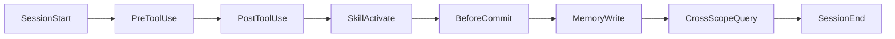
```mermaid
flowchart LR
  SessionStart[SessionStart]
  PreTool[PreToolUse]
  PostTool[PostToolUse]
  SkillActivate[SkillActivate]
  BeforeCommit[BeforeCommit]
  MemoryWrite[MemoryWrite]
  CrossScope[CrossScopeQuery]
  SessionEnd[SessionEnd]

  SessionStart --> PreTool --> PostTool --> SkillActivate --> BeforeCommit --> MemoryWrite --> CrossScope --> SessionEnd
```

Hook decisions may approve, block, ask the operator, substitute a skill, inject context, or observe only, depending on the event type and policy.

---

## Local-first mesh

A mesh is a graph of local scopes. A scope is usually a repository, worktree, or project folder with its own `.git/` and `.orqenix/` state.

### Scope anatomy

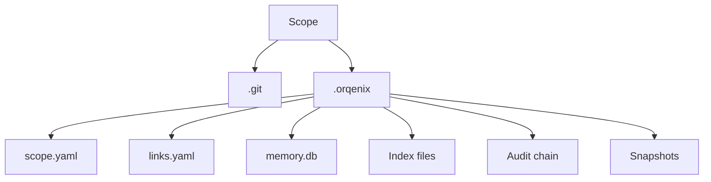
```mermaid
flowchart TB
  Scope[Scope]
  Git[.git]
  OrqenixDir[.orqenix]
  ScopeYaml[scope.yaml]
  Links[links.yaml]
  MemoryDB[memory.db]
  KB[Index files]
  Audit[Audit chain]
  Snapshots[Snapshots]

  Scope --> Git
  Scope --> OrqenixDir
  OrqenixDir --> ScopeYaml
  OrqenixDir --> Links
  OrqenixDir --> MemoryDB
  OrqenixDir --> KB
  OrqenixDir --> Audit
  OrqenixDir --> Snapshots
```

### Mesh link model

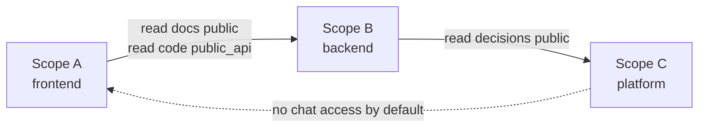
```mermaid
flowchart LR
  A[Scope A<br/>frontend] -->|read docs public<br/>read code public_api| B[Scope B<br/>backend]
  B -->|read decisions public| C[Scope C<br/>platform]
  C -. no chat access by default .-> A
```

### Capability token lifecycle

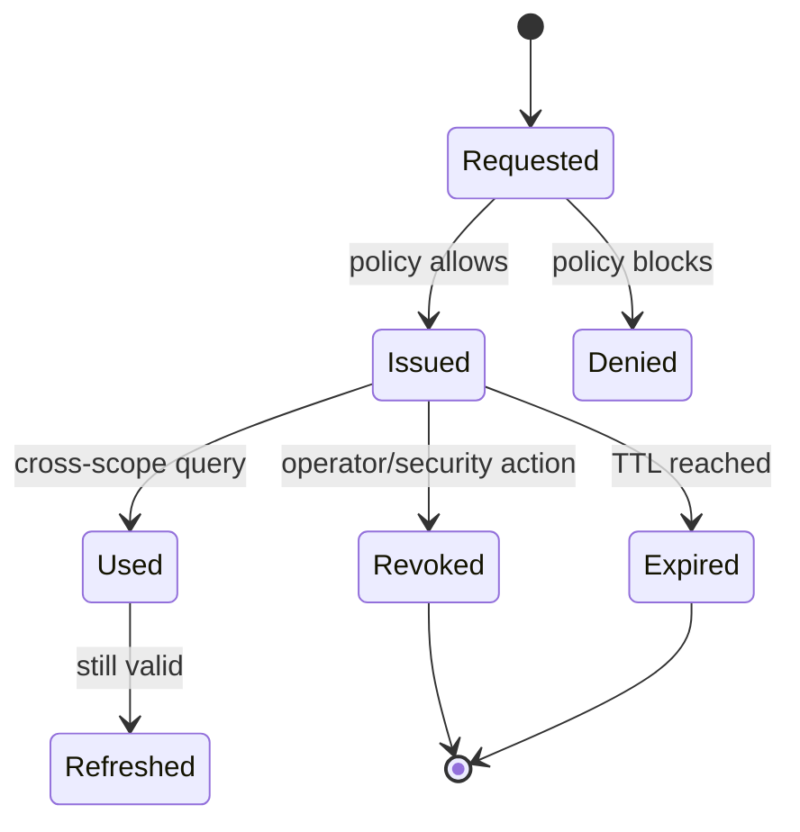
```mermaid
stateDiagram-v2
  [*] --> Requested
  Requested --> Issued: policy allows
  Requested --> Denied: policy blocks
  Issued --> Used: cross-scope query
  Used --> Refreshed: still valid
  Issued --> Revoked: operator/security action
  Issued --> Expired: TTL reached
  Revoked --> [*]
  Expired --> [*]
```

### Example `scope.yaml`

```yaml
version: 1
scope:
  id: blake3:7f3a2c8d12345abc
  display_name: billing-api
  description: Billing API and webhook processing service
  created: 2026-06-01T10:00:00Z

  git:
    remote: git@github.com:example/billing-api.git
    default_branch: main

  authorized_identities:
    - fingerprint: ed25519:abc123
      label: maintainer@github
      role: owner
      added: 2026-06-01

  share_policy:
    docskb:
      visibility: public
      tag_filter: []
    codekb:
      visibility: public_api
      symbol_filter: []
    decisionkb:
      visibility: public
      tag_filter: [public]
    chatkb:
      visibility: private

  default_link_permissions:
    direction: incoming
    read:
      - docskb.public
      - codekb.public_api
      - decisionkb.public
    write: []
    duration: persistent
    delegatable: false

declared_links:
  - target_scope_id: blake3:9b4d1e7a
    nickname: checkout-web
    link_type: code_dependency
```

---

## Workbench

Workbench is the local UI layer for Orqenix.

### Workbench product role

Workbench is not a hosted dashboard. It is intended to be a local control room for Orqenix:

- Memory matrix.
- Mesh topology.
- Audit chain verification.
- Marketplace CRUD.
- Self-learning review.
- Session/branch visibility.
- Settings registry.
- Observability and runtime status.

### Workbench architecture

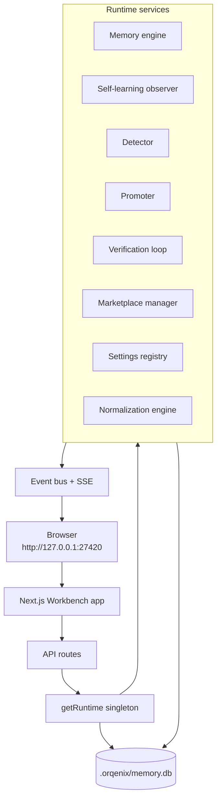
```mermaid
flowchart TB
  Browser[Browser<br/>http://127.0.0.1:27420]
  Next[Next.js Workbench app]
  API[API routes]
  Runtime[getRuntime singleton]
  EventBus[Event bus + SSE]
  DB[(.orqenix/memory.db)]

  subgraph Services[Runtime services]
    Engine[Memory engine]
    Observer[Self-learning observer]
    Detector[Detector]
    Promoter[Promoter]
    Verification[Verification loop]
    Marketplace[Marketplace manager]
    Settings[Settings registry]
    Normalization[Normalization engine]
  end

  Browser --> Next
  Next --> API
  API --> Runtime
  Runtime --> Services
  Runtime --> DB
  Services --> DB
  Services --> EventBus
  EventBus --> Browser
```

### Workbench screens

| Screen | Purpose | Data source |
| --- | --- | --- |
| Dashboard | Matrix, sessions, audit, learning candidates | Runtime + memory DB |
| Memory | Memory tiers and KB matrix | Memory engine |
| Mesh | Local links, capabilities, topology | Mesh/link state |
| Audit | BLAKE3 audit chain timeline and verification | Audit chain |
| Marketplace | Plugin list, create, fork, export, delete | Marketplace manager |
| Learning | Observer state, candidate patterns, promotion review | Self-learning pipeline |
| Sessions | Active, paused, historical sessions | Session tables |
| Branches | Branch tree and deep-copy memory state | Branch tables |
| Settings | Phase-locked module configuration | Settings registry + overrides |
| Observability | Counts, latency, SLO, runtime metrics | Runtime API |

---

## Methodology

Orqenix development uses an evidence-first methodology. The project does not treat a feature as equally real at every stage. Specs, branches, reports, package metadata, public main, npm, and releases all carry different levels of canonical weight.

### Evidence ladder

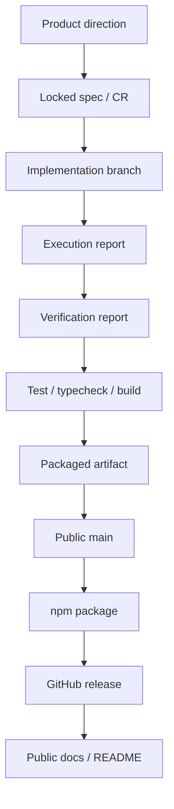
```mermaid
flowchart TB
  Direction[Product direction]
  Spec[Locked spec / CR]
  Implementation[Implementation branch]
  ExecutionReport[Execution report]
  VerifyReport[Verification report]
  Typecheck[Test / typecheck / build]
  Package[Packaged artifact]
  PublicMain[Public main]
  Npm[npm package]
  Release[GitHub release]
  Docs[Public docs / README]

  Direction --> Spec --> Implementation --> ExecutionReport --> VerifyReport --> Typecheck --> Package --> PublicMain --> Npm --> Release --> Docs
```

### How README claims should be read

| Claim type | Evidence required | Example |
| --- | --- | --- |
| Product positioning | Product docs, CR, public docs | "local-first knowledge fabric + control plane" |
| Implemented in a branch | Execution report or branch evidence | Workbench Phase 8 reports |
| Verified | Verification report, test output, typecheck/build evidence | Workbench verification kit, D8 verify reports |
| Publicly canonical | Public GitHub main, npm package, release notes | OSS main branch, npm public packages |
| Fully released | GitHub Release + npm + docs alignment | Not fully converged for every Phase 8 element |

---

## Quick start

> The exact package names and versions available to you depend on the current convergence state of public npm and your local checkout. If a command is unavailable in your installed version, check the repository branch, package version, or Workbench/Phase report that introduced it.

### Requirements

- Node.js `>=20`
- pnpm `>=9`
- Git
- A project directory, preferably with `.git/`
- Optional: local model / BYOK provider for advanced distillation or prompt rewriting

### Install the CLI in a project

```bash
pnpm add -D @orqenix/cli
pnpm exec orqenix version
pnpm exec orqenix doctor
```

### Initialize Orqenix in a repository

```bash
cd path/to/your/repo
pnpm exec orqenix init
pnpm exec orqenix doctor
```

### Index and query knowledge

```bash
pnpm exec orqenix knowledge index
pnpm exec orqenix knowledge status
pnpm exec orqenix knowledge query "what owns billing retry policy?"
```

### Record decisions and lessons

```bash
pnpm exec orqenix decide "Use capability tokens for cross-scope reads"
pnpm exec orqenix lesson "Cross-scope query results must include provenance"
```

### Recall memory

```bash
pnpm exec orqenix recall search "capability tokens"
pnpm exec orqenix recall timeline --since=7d
```

### Link another local scope

```bash
pnpm exec orqenix link add ../api --read=docskb.public --read=codekb.public_api
pnpm exec orqenix mesh status
pnpm exec orqenix mesh query "where is webhook signature verification implemented?"
```

### Run Workbench if your checkout contains it

```bash
pnpm wb:verify
pnpm wb:dev
# open http://127.0.0.1:27420
```

---

## Installation

### As a local dev dependency

```bash
pnpm add -D @orqenix/cli
pnpm exec orqenix init
```

### As a global CLI

```bash
pnpm add -g @orqenix/cli
orqenix doctor
```

### From source

```bash
git clone https://github.com/milosaysyolo/Orqenix.git
cd Orqenix
pnpm install --frozen-lockfile
pnpm build
pnpm typecheck
pnpm test
```

### With Orqenix-Pro as a sibling repository

Some cross-repo gates and Pro workflows expect Orqenix and Orqenix-Pro to be sibling folders:

```text
~/work/
├── Orqenix/
└── Orqenix-Pro/
```

---

## CLI guide

The CLI surface is broad because Orqenix controls initialization, knowledge, memory, mesh, lifecycle, plugins, security, Workbench support, and migration. Not every command is necessarily available in every public package version.

### Essential commands

```bash
orqenix init
orqenix doctor
orqenix config
orqenix version
orqenix update
```

### Knowledge commands

```bash
orqenix knowledge index
orqenix knowledge query <text>
orqenix knowledge status
orqenix knowledge reindex
orqenix reindex full
orqenix reindex light
orqenix reindex status
```

### Memory commands

```bash
orqenix memory status
orqenix memory inspect <kb>
orqenix memory show <kb> <id>
orqenix memory grep <kb> <pattern>
orqenix memory cleanup
orqenix memory sweep
orqenix memory vacuum
orqenix memory export
orqenix memory import
orqenix recall <ref_id>
orqenix recall timeline
orqenix recall search <query>
```

### Mesh commands

```bash
orqenix scope show
orqenix scope verify
orqenix scope identity show
orqenix link add <path>
orqenix link list
orqenix link verify
orqenix link refresh
orqenix mesh status
orqenix mesh validate
orqenix mesh query <text>
orqenix mesh trace <ref>
```

### Marketplace commands

```bash
orqenix mp search <text>
orqenix mp info <name>
orqenix mp install <name>
orqenix mp update <name>
orqenix mp uninstall <name>
orqenix mp list
orqenix mp publish
```

### Lifecycle commands

```bash
orqenix gc status
orqenix gc run --dry-run
orqenix gc run
orqenix trash list
orqenix trash restore <ref>
orqenix history
orqenix restore <generation>
orqenix audit
```

### Security commands

```bash
orqenix security tokens list
orqenix security tokens show <jti>
orqenix security tokens verify <jti>
orqenix security tokens revoke <jti>
orqenix security audit
orqenix security policy validate
```

### Detach commands

```bash
orqenix detach --dry-run
orqenix detach
orqenix attach --restore
orqenix attach --from=<archive>
orqenix purge --scope=<id>
```

### Workbench commands

```bash
pnpm wb:preflight
pnpm wb:verify
pnpm wb:dev
```

---

## Repository and storage layout

### Project layout after `orqenix init`

```text
your-project/
├── .git/
├── .orqenix/
│   ├── scope.yaml
│   ├── links.yaml
│   ├── config.yaml
│   ├── memory.db
│   ├── knowledge/
│   ├── snapshots/
│   ├── audit/
│   ├── trash/
│   └── archives/
├── docs/
├── src/
├── tests/
└── package.json
```

### Workbench layout when present

```text
Orqenix/
├── apps/
│   └── workbench/
│       ├── app/
│       ├── components/
│       ├── lib/
│       ├── tests/
│       ├── package.json
│       └── README.md
├── packages/
├── plugins/
├── scripts/
│   └── verify/
└── docs/
```

---

## Packages

### OSS package families

| Family | Examples | Purpose |
| --- | --- | --- |
| CLI and core | `@orqenix/cli`, `@orqenix/core`, `@orqenix/registry` | Command entrypoints, core runtime, registry primitives. |
| Knowledge | `@orqenix/kb-docs`, `@orqenix/kb-code`, `@orqenix/kb-decisions`, `@orqenix/kb-chat`, `@orqenix/kb-query` | Specialized knowledge stores and unified query. |
| Memory | `@orqenix/memory-engine`, `@orqenix/memory-tiers`, `@orqenix/memory-distiller`, `@orqenix/local-memory-federation` | Persistent memory, matrix state, federation, distillation. |
| Mesh | `@orqenix/scope-identity`, `@orqenix/scope-link`, `@orqenix/mesh-routing`, `@orqenix/capability-tokens` | Local-first scope graph and permissions. |
| Marketplace | `@orqenix/plugin-core`, `@orqenix/marketplace-core`, `@orqenix/normalization-engine`, adapters | Plugin/skill packaging, import/export, CRUD, normalization. |
| Self-learning | `@orqenix/self-learning-observer`, `@orqenix/self-learning-detection`, `@orqenix/skill-genesis`, `@orqenix/instinct-promoter`, `@orqenix/verification-loop` | Observe patterns, propose skills, verify before promotion. |
| Operations | `@orqenix/audit-log`, `@orqenix/detach`, `@orqenix/lifecycle`, `@orqenix/settings-registry` | Audit, detach, GC, settings, lifecycle. |
| MCP and integrations | `@orqenix/mcp-server`, `@orqenix/mcp-client`, editor/runtime adapters | External tool protocol and runtime integration. |

### Orqenix-Pro package families

| Family | Examples | Purpose |
| --- | --- | --- |
| License | `@orqenix-pro/license` | BSL/BUSL license verification, signing, grace period, feature checks. |
| Pro knowledge | `@orqenix-pro/knowledge-intel`, `@orqenix-pro/kb-code-graph`, `@orqenix-pro/kb-embedding-lance` | Higher-end ranking, code graph, vector backends. |
| Pro memory | `@orqenix-pro/memory-distiller-llm` | LLM-based distillation beyond OSS heuristics. |
| Pro mesh | `@orqenix-pro/mesh-delegation`, `@orqenix-pro/blast-radius` | Delegation and impact analysis. |
| Pro operations | `@orqenix-pro/pro-migration`, `@orqenix-pro/polyglot-backend` | Migration and backend abstraction. |

---

## Configuration

Orqenix configuration is layered:

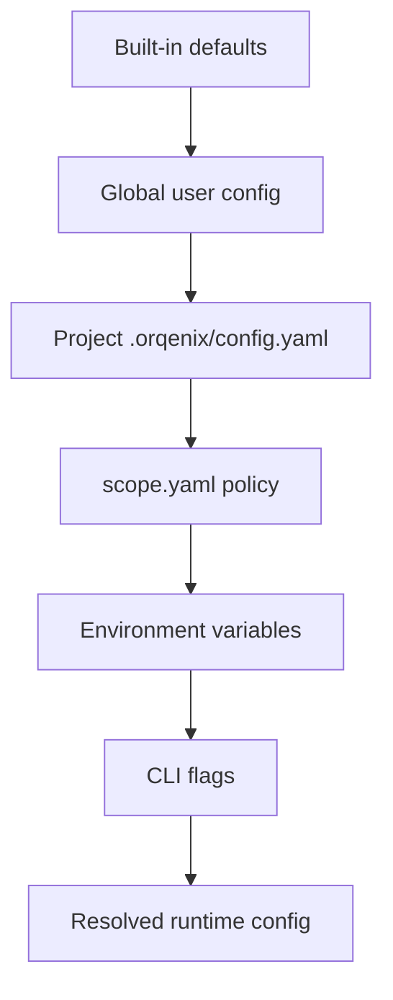
```mermaid
flowchart TB
  Defaults[Built-in defaults]
  Global[Global user config]
  Project[Project .orqenix/config.yaml]
  Scope[scope.yaml policy]
  Env[Environment variables]
  CLI[CLI flags]
  Runtime[Resolved runtime config]

  Defaults --> Global --> Project --> Scope --> Env --> CLI --> Runtime
```

### Configuration areas

| Area | Examples |
| --- | --- |
| Providers | BYOK keys, local model fallback, routing policy. |
| Memory | Tier budgets, retention, injection limits, distillation strategy. |
| Knowledge | Index include/exclude rules, KB backend, embedding provider. |
| Mesh | Link policy, default visibility, capability TTL, delegation. |
| Marketplace | Registry sources, verification policy, signing requirements. |
| Workbench | Port, runtime DB path, dev mode, UI settings, module overrides. |
| Security | Authorized identities, revocation, sandbox mode, audit export. |

---

## Security and governance

### Security model

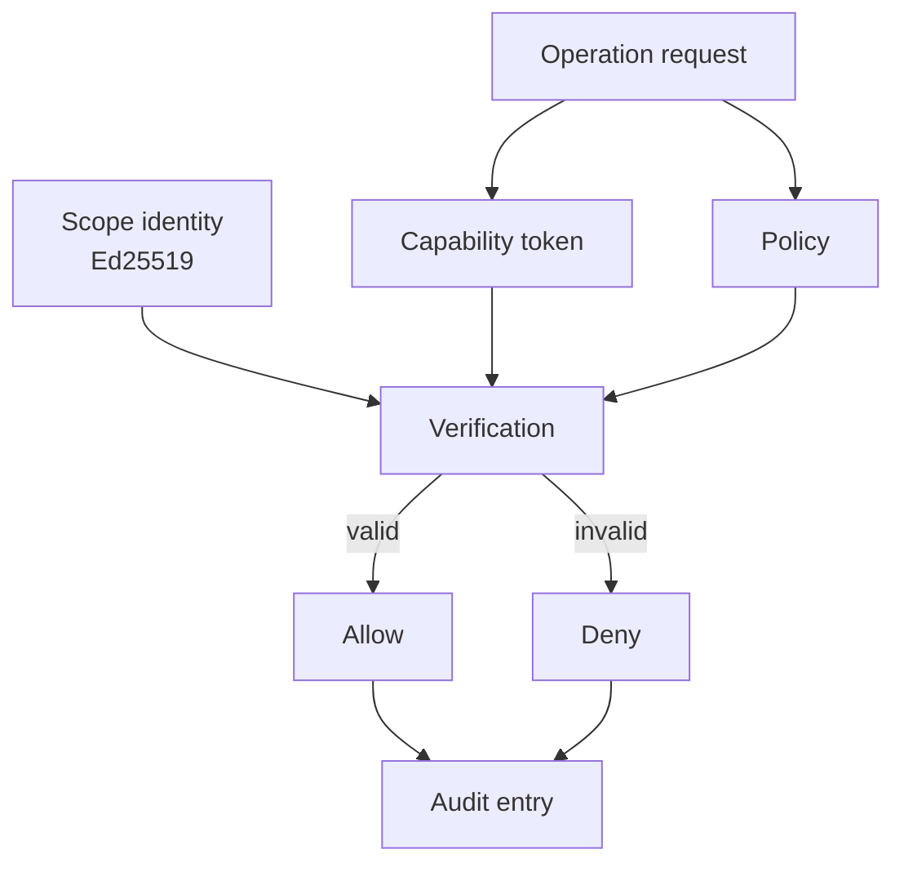
```mermaid
flowchart TB
  Identity[Scope identity<br/>Ed25519]
  Policy[Policy]
  Token[Capability token]
  Request[Operation request]
  Verify[Verification]
  Allow[Allow]
  Deny[Deny]
  Audit[Audit entry]

  Request --> Policy
  Request --> Token
  Identity --> Verify
  Token --> Verify
  Policy --> Verify
  Verify -->|valid| Allow
  Verify -->|invalid| Deny
  Allow --> Audit
  Deny --> Audit
```

### Governance rules

| Rule | Reason |
| --- | --- |
| Cross-scope access requires capability. | Local mesh should not become implicit global trust. |
| ChatKB is private by default. | Chat/session memory often contains operator intent and sensitive details. |
| Destructive actions should support dry-run. | Agents and operators need previewable safety. |
| Snapshots precede destructive changes. | Restore must be possible after GC, detach, migration, or plugin operations. |
| Audit logs are append-only. | Debuggability and accountability require immutable history. |
| Plugin installs require policy. | Marketplace and supply-chain risk must be bounded. |
| Learning promotion requires verification. | Self-learning without verification creates drift. |

---

## Lifecycle and detach

### Artifact lifecycle

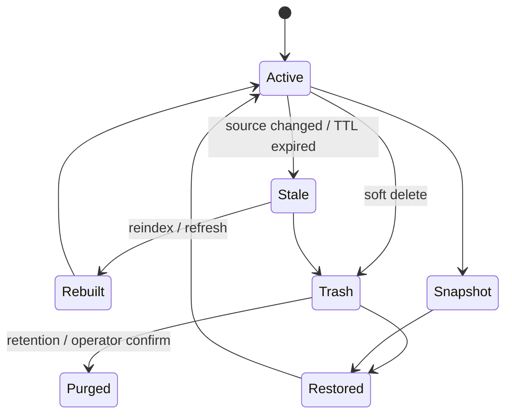
```mermaid
stateDiagram-v2
  [*] --> Active
  Active --> Stale: source changed / TTL expired
  Stale --> Rebuilt: reindex / refresh
  Rebuilt --> Active
  Active --> Trash: soft delete
  Stale --> Trash
  Trash --> Restored
  Restored --> Active
  Trash --> Purged: retention / operator confirm
  Active --> Snapshot
  Snapshot --> Restored
```

### Scope lifecycle

```mermaid
stateDiagram-v2
  [*] --> Initialized
  Initialized --> Indexing
  Indexing --> Active
  Active --> Stale
  Stale --> Rebuilding
  Rebuilding --> Active
  Active --> Detached
  Stale --> Detached
  Detached --> Initialized: attach / restore
  Detached --> Purged
```

### Detach flow

```mermaid
flowchart TB
  Start[orqenix detach]
  DryRun[Compute touched files + fenced blocks]
  Preview[Show preview]
  Snapshot[Create snapshot/archive]
  Remove[Remove Orqenix-managed state]
  Verify[Verify project source untouched]
  Done[Detached]

  Start --> DryRun --> Preview --> Snapshot --> Remove --> Verify --> Done
```

Detach exists because Orqenix intentionally writes state next to a project. Anything that can attach should also be able to detach cleanly.

---

## Testing and verification

### Verification layers

```mermaid
flowchart LR
  Unit[Unit tests]
  Typecheck[Typecheck]
  PackageBuild[Package build]
  Integration[Integration tests]
  Gate[Charter gates]
  Smoke[Install / boot smoke]
  Report[Execution report]

  Unit --> Typecheck --> PackageBuild --> Integration --> Gate --> Smoke --> Report
```

### Typical local checks

```bash
pnpm install --frozen-lockfile
pnpm build
pnpm typecheck
pnpm test
pnpm lint
```

### Workbench checks when present

```bash
pnpm wb:preflight
node scripts/verify/wb-install.mjs
pnpm --filter @orqenix/workbench vitest run tests/migrations.test.ts
pnpm --filter @orqenix/workbench vitest run tests/runtime-api.test.ts
node scripts/verify/wb-build.mjs
node scripts/verify/wb-boot.mjs
pnpm wb:verify
```

---

## Roadmap

### Product direction

```mermaid
flowchart LR
  P1[Foundation]
  P2[Capabilities]
  P3[Context optimization]
  P4[Knowledge + lifecycle]
  P5[Scope identity + mesh]
  P6[Transport / Pro hardening]
  P8[Workbench + self-learning + marketplace]
  Conv[Public convergence]

  P1 --> P2 --> P3 --> P4 --> P5 --> P6 --> P8 --> Conv
```

### Near-term convergence priorities

1. Reconcile README, public main, npm packages, and GitHub Releases.
2. Mark every Phase 8 / Workbench feature with exact availability: merged, branch-only, package-only, report-only, or released.
3. Ensure install instructions map to published package versions.
4. Keep Workbench verification reproducible with `pnpm wb:verify`.

---

## License

### Orqenix OSS core

Orqenix core is Apache-2.0.

### Orqenix-Pro

Orqenix-Pro uses a Business Source License / BUSL-style model for Pro packages, with release-specific conversion rules. Treat Pro packages separately from the OSS core.

---

## FAQ

### Is Orqenix an agent framework?

Not primarily. Orqenix is a local-first knowledge fabric and control plane around agents. It can coordinate agent frameworks and runtimes, but its main job is memory, knowledge, governance, orchestration, lifecycle, and observability.

### Does Orqenix require the cloud?

No. The core architecture is local-first. Remote sync and cloud features can exist later or in separate tiers, but local project knowledge is the baseline.


### Can I rely on every command listed here?

Only if your installed package or checkout includes the relevant implementation. Use `orqenix help`, `orqenix doctor`, package version checks, and the verification commands for your checkout.

### What is Workbench?

Workbench is the local UI/control room for Orqenix. It exposes memory, mesh, audit, marketplace, learning, sessions, branches, settings, observability, and runtime status.

### What is the main differentiator?

Orqenix combines local-first project memory, scoped knowledge, governed multi-agent orchestration, capability-based mesh, lifecycle/detach, and evidence-driven release discipline in one control plane.

---

## Minimal checklist

```bash
# install
pnpm add -D @orqenix/cli

# initialize
pnpm exec orqenix init
pnpm exec orqenix doctor

# knowledge
pnpm exec orqenix knowledge index
pnpm exec orqenix knowledge query "what decisions affect auth?"

# memory
pnpm exec orqenix decide "Cross-scope reads require capability tokens"
pnpm exec orqenix recall search "cross-scope reads"

# mesh
pnpm exec orqenix link add ../api --read=docskb.public --read=codekb.public_api
pnpm exec orqenix mesh status

# workbench, if present in your checkout
pnpm wb:verify
pnpm wb:dev
```

---

## Final positioning

**Orqenix is the local-first knowledge fabric and control plane for multi-agent AI systems: it gives agents durable project memory, cross-repository knowledge with provenance, governed skills and plugins, scope-aware security, deterministic orchestration, lifecycle safety, and a Workbench control room while keeping public status honest about release convergence.**


