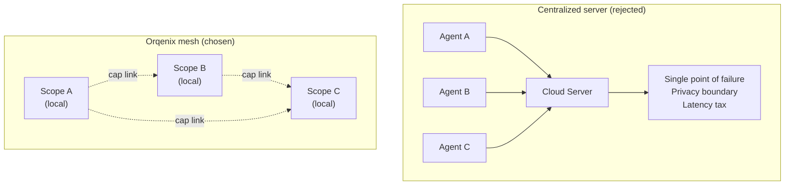
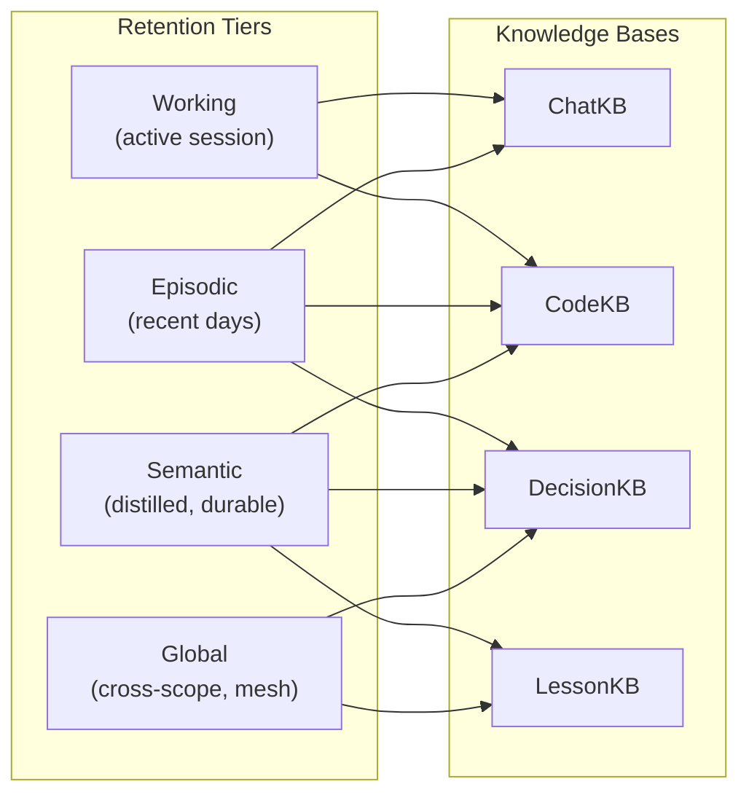
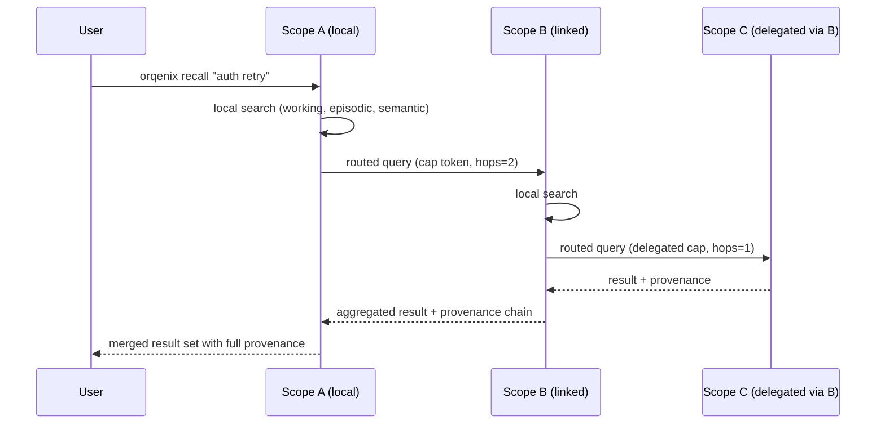
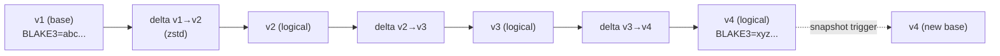
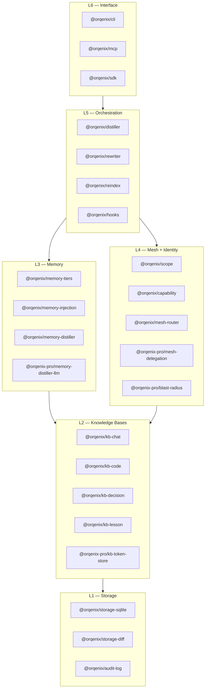
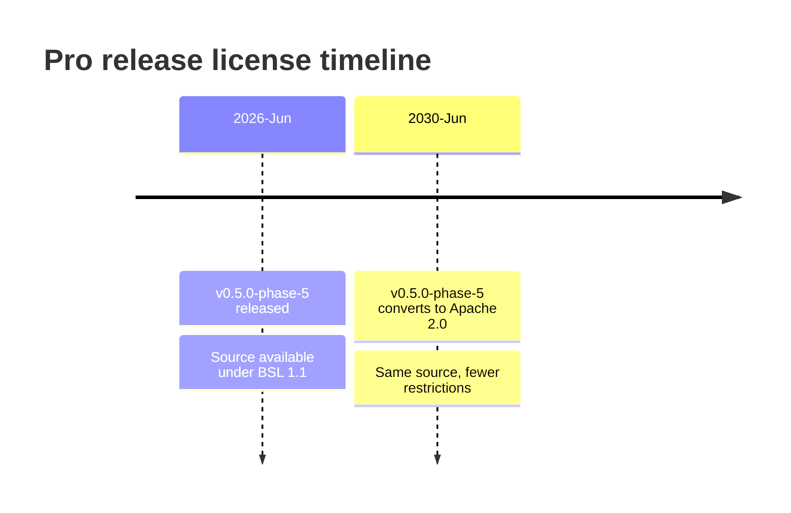

<p align="center">
  
</p>

<h1 align="center">Orqenix</h1>
<p align="center">
  <strong>The local-first knowledge fabric for multi-project AI development.</strong>
</p>
<p align="center">
  Mesh-linked scopes, capability-based permissions, polyglot knowledge graphs,<br/>
  and compress-as-memorize semantics, all running on your machine.
</p>

<p align="center">
  <a href="https://www.npmjs.com/package/@orqenix/core"></a>
  <a href="https://github.com/milosaysyolo/Orqenix/actions/workflows/ci.yml"></a>
  <a href="https://github.com/milosaysyolo/Orqenix/blob/main/LICENSE"></a>
  <a href="https://github.com/milosaysyolo/Orqenix-Pro/blob/main/LICENSE"></a>
  <a href="https://nodejs.org"></a>
</p>

<p align="center">
  <a href="https://github.com/milosaysyolo/Orqenix/discussions"></a>
  <a href="<!-- TBD: discord-invite -->"></a>
  <a href="https://x.com/<!-- TBD: twitter-handle -->"></a>
  <a href="https://github.com/milosaysyolo/Orqenix/stargazers"></a>
</p>

<p align="center">
  <a href="#-quick-start">Quick Start</a> ·
  <a href="#-why-orqenix">Why Orqenix</a> ·
  <a href="#-architecture">Architecture</a> ·
  <a href="./docs/getting-started.md">Docs</a> ·
  <a href="./ROADMAP.md">Roadmap</a> ·
  <a href="https://github.com/milosaysyolo/Orqenix/discussions">Community</a>
</p>

---

## What is Orqenix?

Modern AI coding agents are stateless. Every conversation starts from zero, every project lives on its own island, and every hard-won lesson evaporates the moment the context window fills up. Vector databases help, but they retrieve noise, lose causality, and offer no story about where a fact came from. The result is a fleet of agents that look smart in isolation but forget everything that makes a senior engineer valuable: history, judgment, and cross-project pattern matching.

Orqenix is the layer underneath your agents that fixes this. It is a **production-grade knowledge fabric** that gives AI agent systems durable, structured memory, cross-project knowledge sharing through a local-first mesh, and verifiable provenance for every recalled fact. It does not replace your agent framework. It powers it.

### Key principles

1. **Local-first, no DHT, no P2P discovery.** Your data stays on your machine. Mesh is opt-in, point-to-point, and capability-gated. There is no global network to join, no node to register with, and no cloud dependency in the OSS tier.
2. **Scope equals git repo plus `.orqenix/` folder.** If you can `git clone` it, you can carry it. If you can `rm -rf .orqenix/`, you can leave it. No hidden state, no lock-in.
3. **Capability-based permission model, not network-based.** Sharing between scopes is governed by signed capability tokens with directional links, not by IP allowlists or shared secrets. Mesh delegation chains, blast-radius quotas, and audit logs are first-class concepts.
4. **Compress-as-memorize philosophy.** Memory is not infinite, so compression is not an afterthought. Four strategies (truncate, summarize, hierarchical distill, LLM rewriter) run as part of the write path, with background distillation keeping retrieval cheap.
5. **Polyglot storage, adapter-first.** SQLite is the default for portability. LMDB, Kuzu, and LanceDB are opt-in through the Pro tier when you outgrow it. The KB contracts stay stable; the engine swaps underneath.
6. **Diff-only, content-addressed storage.** Documents are stored as BLAKE3-keyed base snapshots plus zstd-compressed Myers diffs. Reconstruction is verifiable; tampering is detectable; storage cost is sub-linear.
7. **Provenance everywhere.** Every recall result is tagged with its origin scope, the capability used to reach it, and the chain of transformations that produced it. No black-box retrieval.
8. **Modular charter-gated architecture.** Every package ships with charter gates (G1 through G35 in OSS, plus Pro-specific gates). Gates are automated acceptance tests with explicit criteria, runnable via `npm run verify:phase-5`. If a PR breaks a gate, the CI blocks it.

### High-level architecture

```mermaid
flowchart LR
    subgraph User["User Surface"]
        CLI["CLI<br/>(orqenix)"]
        SDK["TypeScript SDK<br/>(@orqenix/sdk)"]
        MCP["MCP Server<br/>(@orqenix/mcp)"]
    end

    subgraph Core["Orqenix Core"]
        Orch["Orchestration<br/>(distiller, rewriter, hooks)"]
        Mesh["Mesh + Identity<br/>(capability, routing)"]
        Memory["Memory Tiers<br/>(working, episodic, semantic, global)"]
        KB["Knowledge Bases<br/>(Chat, Code, Decision, Lesson)"]
        Store["Storage<br/>(SQLite + diff-only)"]
    end

    subgraph Peer["Peer Scopes"]
        ScopeA["Scope A<br/>(your other repo)"]
        ScopeB["Scope B<br/>(teammate's repo)"]
    end

    User --> Orch
    Orch --> Memory
    Memory --> KB
    KB --> Store
    Orch --> Mesh
    Mesh -.capability link.-> ScopeA
    Mesh -.capability link.-> ScopeB
````

***

## The Problem Space

Before reading the rest of this README, it helps to share a mental model of *why* Orqenix is shaped the way it is. If you already know the pain, feel free to jump to the #quickstart.

### Why current AI agents forget

A large language model is a pure function. Given the same prompt, it returns roughly the same output. It has no memory of yesterday's debugging session, no awareness of a sibling project where you already solved the same problem, and no concept of *which* code conventions your team enforces this quarter. Every helpful behaviour you experience inside a chat session is the result of someone stuffing context into the prompt window.

This creates three concrete failure modes:

* **Session amnesia.** When the context window fills, the oldest turns are evicted. Whatever lesson was learned in turn 3 is gone by turn 50.
* **Project isolation.** Even if you persist state per project, each project is a silo. The agent helping you in `repo-A` cannot see the architectural decision you locked in `repo-B` last month.
* **Tooling fragmentation.** Some IDEs persist chat. Some agents persist tool traces. Almost none persist *durable, structured* knowledge that survives a model upgrade, a tool change, or a teammate handoff.

```mermaid
flowchart LR
    subgraph Today["Today: stateless agents"]
        T1["Turn 1"] --> T2["Turn 2"] --> T3["Turn N"] --> X["Context eviction<br/>= forgotten"]
    end
    subgraph Orq["With Orqenix"]
        O1["Turn 1"] --> O2["Turn 2"] --> O3["Turn N"]
        O1 --> D["Distill"]
        O2 --> D
        O3 --> D
        D --> KB["Knowledge Base<br/>(durable, queryable)"]
        KB --> Recall["Recall at any future turn"]
    end
```

### Why naive vector DB is not enough

The most common answer to "AI memory" today is to drop everything into a vector database and call it RAG. This works for chat-with-PDF demos. It breaks down for agent memory because:

* **Noise dominates.** Without filtering, every chat turn, every tool call, and every error log becomes an embedding. Top-k retrieval drowns relevant signal in stale chatter.
* **Causality is lost.** A vector index does not know that *Decision D was reverted because of Lesson L which was triggered by Bug B*. It only knows cosine similarity.
* **No compression hierarchy.** Vector DBs treat all entries equally. A senior engineer's brain does not. It summarizes weekly, archives monthly, and forgets aggressively.
* **No provenance.** A retrieved chunk has no signature, no origin, and no chain of custody. You cannot tell whether it came from a trusted teammate, an out-of-date doc, or a hallucinated answer that got written back.

Orqenix uses vectors where they are appropriate (embedding-backed semantic search inside `@orqenix/storage-sqlite` via sqlite-vec) but treats them as one retrieval mode among many, behind a structured KB layer with provenance, hash-chains, and tiered compression.

### Why mesh, not centralized server

A natural temptation is to build a central memory server: one cloud endpoint, every agent talks to it, problem solved. Orqenix deliberately rejects that design.

* **Privacy.** Your unreleased product roadmap, your client's source code, and your team's internal post-mortems do not belong on a third-party server by default.
* **Ownership.** When your knowledge lives in a folder you can `git clone`, you own it. When it lives in a SaaS, you rent it.
* **Latency.** Cross-scope queries that hit a local SQLite file return in single-digit milliseconds. A round-trip to a cloud server is one to two orders of magnitude slower.
* **Offline-first.** Coding on a plane, in a tunnel, or on a corporate VPN with flaky egress should not break your agent.
* **Git alignment.** Developers already version, branch, and review state with git. A scope that *is* a git folder slots into that workflow on day one.


```mermaid
flowchart TB
    subgraph Central["Centralized server (rejected)"]
        AgentA1["Agent A"] --> Server["Cloud Server"]
        AgentB1["Agent B"] --> Server
        AgentC1["Agent C"] --> Server
        Server --> Risk["Single point of failure<br/>Privacy boundary<br/>Latency tax"]
    end
    subgraph Mesh["Orqenix mesh (chosen)"]
        ScopeA["Scope A<br/>(local)"] -.cap link.-> ScopeB["Scope B<br/>(local)"]
        ScopeB -.cap link.-> ScopeC["Scope C<br/>(local)"]
        ScopeA -.cap link.-> ScopeC
    end
```

The result is a mesh in the original sense of the word: a set of peer scopes that link selectively, share with explicit permission, and remain useful in isolation.

***

## Why Orqenix?

Orqenix sits in a crowded landscape. Here is how it differentiates from the projects you may already be evaluating.

### Comparison matrix

| Project        | Local-first | Mesh routing | Memory tiers      | Polyglot storage | Capability auth  | Diff storage    | MCP native | Provenance   | Compression engine | License              | Primary target       | Maturity |
| -------------- | ----------- | ------------ | ----------------- | ---------------- | ---------------- | --------------- | ---------- | ------------ | ------------------ | -------------------- | -------------------- | -------- |
| **Orqenix**    | ✅           | ✅            | ✅ 4 tiers × 4 KBs | ✅ (Pro)          | ✅ Ed25519 + caps | ✅ BLAKE3 + zstd | ✅          | ✅ Full chain | ✅ 4 strategies     | Apache 2.0 + BSL 1.1 | Multi-project AI dev | Phase 5  |
| Claude Cowork  | Partial     | ❌            | ⚠️ Single tier    | ❌                | ❌                | ❌               | ✅          | ⚠️ Partial   | ❌                  | Proprietary          | Solo dev             | Beta     |
| Qoder Work     | Partial     | ❌            | ⚠️ Session-scoped | ❌                | ❌                | ❌               | ⚠️         | ❌            | ❌                  | Proprietary          | IDE users            | Early    |
| Hermes Agent   | ❌           | ❌            | ✅ Custom          | ❌                | ❌                | ❌               | ⚠️         | ⚠️           | ⚠️                 | Source-available     | Agent runtime        | Alpha    |
| OpenCode       | ✅           | ❌            | ⚠️ Project-local  | ❌                | ❌                | ❌               | ✅          | ❌            | ❌                  | MIT                  | CLI coding           | Active   |
| CrewAI         | ❌           | ❌            | ⚠️ Plugin-based   | ❌                | ❌                | ❌               | ⚠️         | ❌            | ❌                  | MIT                  | Agent crews          | Mature   |
| LangGraph      | ❌           | ❌            | ⚠️ Checkpointer   | ❌                | ❌                | ❌               | ⚠️         | ❌            | ❌                  | MIT                  | Graph workflows      | Mature   |
| AG2 (AutoGen)  | ❌           | ❌            | ⚠️ Plugin-based   | ❌                | ❌                | ❌               | ⚠️         | ❌            | ❌                  | Apache 2.0           | Multi-agent chat     | Mature   |
| Strands        | ❌           | ❌            | ⚠️ Built-in       | ❌                | ❌                | ❌               | ⚠️         | ❌            | ❌                  | Apache 2.0           | AWS agents           | Active   |
| Microsoft APM  | ❌           | ❌            | ✅                 | ❌                | ❌                | ❌               | ⚠️         | ⚠️           | ❌                  | Proprietary          | Enterprise           | Preview  |
| Mem0           | Partial     | ❌            | ✅ 2 tiers         | ❌                | ❌                | ❌               | ⚠️         | ❌            | ⚠️                 | Apache 2.0           | Memory layer         | Active   |
| Letta (MemGPT) | Partial     | ❌            | ✅ Self-edit       | ❌                | ❌                | ❌               | ⚠️         | ❌            | ✅                  | Apache 2.0           | Research             | Active   |

Legend: ✅ first-class, ⚠️ partial or via plugin, ❌ absent.

### Who is Orqenix for?

> **🧑‍💻 Solo developer with many projects**
> You hop between five repos a day. You keep solving the same auth bug, re-deriving the same architectural decision, and rewriting the same prompt rules. Orqenix gives you one local mesh where every project contributes lessons to a shared graph you control.

> **👥 Small multi-project team**
> Your team owns a frontend, a backend, an infra repo, and a docs site. Each repo has its own conventions but they share principles. Orqenix lets each repo publish a scope, link selectively, and recall across boundaries without standing up a shared service.

> **🏢 Enterprise eng org evaluating AI agent rollouts**
> You need audit logs, capability-based access, deterministic provenance, and a clear license story before letting agents touch production knowledge. Orqenix ships all four as defaults and exposes them through the Pro tier's blast-radius quotas and mesh delegation chains.

> **🛠️ AI agent framework author**
> You build on top of LangGraph, CrewAI, AG2, or your own runtime. You do not want to reinvent memory. Orqenix exposes a stable TypeScript SDK and MCP server you can adopt as the memory backend behind your framework.

### Non-goals (anti-patterns we reject)

* **Orqenix is not an agent framework.** It does not plan, it does not call tools, it does not orchestrate LLMs. Use LangGraph, CrewAI, AG2, or your own runtime for that. Orqenix is the memory and knowledge layer those frameworks call into.
* **Orqenix is not a vector database.** It uses vectors where appropriate (sqlite-vec) but treats them as a retrieval mode behind a structured KB, not as the primary storage abstraction.
* **Orqenix is not a SaaS-first product.** The OSS tier is fully featured for local mesh. The Cloud tier (Phase 7) adds multi-machine convenience, not a fundamental capability that was paywalled.
* **Orqenix is not a global P2P network.** There is no DHT, no node discovery, no public address book. Mesh is point-to-point and capability-gated by design.
* **Orqenix is not a replacement for git.** It complements git. Your `.orqenix/` folder is committed (or `.gitignore`d) alongside your code, by your choice.

***

## Quickstart

Three paths, depending on how you want to use Orqenix.

### Path A: 60-second CLI quickstart (solo developer)

```bash
# 1. Install the CLI globally (or use npx)
npm install -g @orqenix/cli

# 2. Initialize Orqenix in any git repo
cd my-project
orqenix init

# 3. Record a decision, lesson, or chat
orqenix decide "Use SQLite as default storage; LMDB only when >10M rows" \
  --tags "storage,architecture"

# 4. Recall it later (semantic + structured search)
orqenix recall "what storage engine did we pick?"
```

Expected output:

```text
✓ Scope initialized: scope_4f2a...c8b9
✓ Identity (Ed25519) generated and stored in .orqenix/identity/
✓ Decision logged: dec_01HX2K...

Recall results (1 match, 12ms):
  [decision] "Use SQLite as default storage; LMDB only when >10M rows"
    scope: my-project (local)
    tags:  storage, architecture
    when:  2026-06-03T03:14:22Z
    via:   self
```

Troubleshooting note: if `orqenix init` complains that the directory is not a git repo, run `git init` first. Orqenix intentionally requires a git context to anchor scope identity.

Full installation guide for macOS, Linux, and Windows WSL2 lives in docs/getting-started.md.

### Path B: SDK integration (embed in your app)

Install the SDK alongside any agent framework or custom runtime:

```bash
npm install @orqenix/sdk @orqenix/kb-chat @orqenix/storage-sqlite
```

Minimal TypeScript example:

```typescript
import { OrqenixClient } from "@orqenix/sdk";
import { SqliteConnection } from "@orqenix/storage-sqlite";
import { ChatKB } from "@orqenix/kb-chat";

// 1. Open the local scope (auto-creates .orqenix/ on first run)
const client = await OrqenixClient.open({
  scopePath: process.cwd(),
  storage: await SqliteConnection.open(".orqenix/db.sqlite"),
});

// 2. Append a chat turn (hash-chained, provenance-tagged)
const chat = client.kb(ChatKB);
await chat.append({
  sessionId: "sess:01HX2K...",
  role: "user",
  content: "How do we handle retries on the auth endpoint?",
});

// 3. Recall across all linked scopes with one call
const results = await client.recall({
  query: "auth retry policy",
  scopes: "all-linked",
  limit: 5,
  withProvenance: true,
});

for (const r of results) {
  console.log(`[${r.kind}] ${r.summary}`);
  console.log(`  from: ${r.provenance.scope} via ${r.provenance.capability}`);
}

await client.close();
```

Troubleshooting note: if you see `SqliteMigrationError: checksum drift`, the database was opened by a newer Orqenix version. Run `orqenix migrate up` to align.

### Path C: MCP server (Claude Desktop, Cline, Cursor, Continue)

If you use an MCP-capable agent host, register Orqenix as an MCP server. Example `claude_desktop_config.json`:

```json
{
  "mcpServers": {
    "orqenix": {
      "command": "npx",
      "args": ["-y", "@orqenix/mcp", "serve", "--scope", "/Users/you/projects"],
      "env": {
        "ORQENIX_LOG_LEVEL": "info"
      }
    }
  }
}
```

After restart, your agent gains tools such as `orqenix.recall`, `orqenix.decide`, `orqenix.lesson`, `orqenix.distill`, and `orqenix.mesh.list`. Permission scoping is controlled by the local capability table; the MCP layer never bypasses it.

Troubleshooting note: if tools do not appear, check the MCP server log at `~/.orqenix/logs/mcp.log` and confirm Node 20 or newer is on PATH.

***

## Core Concepts

This section is the conceptual reference for everything that follows. Each sub-section is short on prose and heavy on diagrams and config snippets. Skim it first, then return to it when something in the CLI or SDK surprises you.

### 6.1 Scope and Identity

A **scope** is the unit of ownership and addressing in Orqenix. Concretely, a scope is:

* a git repository, plus
* a `.orqenix/` folder at the repo root that contains the local SQLite database, the Ed25519 identity, capability tokens, and mesh configuration.

Every scope has a deterministic `scope_id` derived from its Ed25519 public key:

```
scope_id = BLAKE3(ed25519_public_key)[:20]   // base32 RFC4648, no padding
```

The `scope.yaml` manifest looks like:

```yaml
# .orqenix/scope.yaml
version: 1
scope_id: scope_4f2ax7c8b9rk2m1p3q5s
name: my-project
created_at: 2026-06-03T03:14:22Z
owner:
  public_key: ed25519:base64...
  fingerprint: blake3:hex...
mesh:
  enabled: true
  default_timeout_ms: 300
storage:
  backend: sqlite
  path: db.sqlite
```

Identity lifecycle:

* **Create** on `orqenix init`. The private key is stored in `.orqenix/identity/scope.key` with `0600` permissions.
* **Rotate** with `orqenix security rotate-identity`. Old key is archived; capability tokens issued under the old key are revoked and reissued.
* **Revoke** with `orqenix security revoke --scope <id>`. Peer scopes that hold a link to this scope receive a revocation marker on next sync.

Compared to a git remote, a scope is closer to a *git repo plus a signed identity card*. The signed identity is what makes capability-based mesh linking possible.

### 6.2 The Memory Matrix

Orqenix stores knowledge in a matrix of **4 retention tiers** × **4 knowledge bases**.


```mermaid
flowchart LR
    subgraph Tiers["Retention Tiers"]
        W["Working<br/>(active session)"]
        E["Episodic<br/>(recent days)"]
        S["Semantic<br/>(distilled, durable)"]
        G["Global<br/>(cross-scope, mesh)"]
    end
    subgraph KBs["Knowledge Bases"]
        Chat["ChatKB"]
        Code["CodeKB"]
        Decision["DecisionKB"]
        Lesson["LessonKB"]
    end
    W --> Chat
    W --> Code
    E --> Chat
    E --> Code
    E --> Decision
    S --> Decision
    S --> Lesson
    S --> Code
    G --> Lesson
    G --> Decision
```

Retention semantics:

| Tier         | Lifetime             | Eviction trigger                   | Typical content                                       |
| ------------ | -------------------- | ---------------------------------- | ----------------------------------------------------- |
| **Working**  | Current session      | Session end or compress trigger    | Raw chat turns, scratch notes                         |
| **Episodic** | Days to weeks        | Capacity threshold or time policy  | Recent decisions, recent tool traces                  |
| **Semantic** | Months to indefinite | Manual archive or schema migration | Distilled lessons, ratified decisions, code summaries |
| **Global**   | Mesh-shared          | Capability revocation or detach    | Selected semantic entries promoted to mesh            |

When to use which:

* **Recall a recent debugging session** → query Working + Episodic ChatKB.
* **Look up an architectural decision from last quarter** → query Semantic DecisionKB.
* **Pull a hard-won lesson from a teammate's scope** → query Global LessonKB through the mesh.
* **Ask "what does this function do?" in a fresh repo** → query Semantic CodeKB, then fall back to Global if the link is set up.

### 6.3 Knowledge Bases

Each KB has a STRICT schema (SQLite `STRICT` tables, foreign keys enforced, cascade deletes on parent removal). Below is a brief tour.

**ChatKB** (`@orqenix/kb-chat`) records conversational turns as a hash-chained log. Each entry's hash is `BLAKE3(role || "\n" || content || prev_hash)`, making the whole session tamper-evident. Session and entry IDs are base32 RFC4648 derived from 20-byte BLAKE3 truncations.

```sql
-- Simplified schema
CREATE TABLE sessions (
  id TEXT PRIMARY KEY,           -- sess:...
  started_at INTEGER NOT NULL,
  scope_id TEXT NOT NULL
) STRICT;

CREATE TABLE entries (
  id TEXT PRIMARY KEY,           -- ce:...
  session_id TEXT NOT NULL REFERENCES sessions(id) ON DELETE CASCADE,
  role TEXT NOT NULL CHECK(role IN ('user','assistant','system','tool')),
  content TEXT NOT NULL,
  prev_hash BLOB,
  hash BLOB NOT NULL,
  created_at INTEGER NOT NULL
) STRICT;

CREATE TABLE embeddings (
  entry_id TEXT PRIMARY KEY REFERENCES entries(id) ON DELETE CASCADE,
  vec BLOB NOT NULL              -- Float32 LE, dim 384 default
) STRICT;
```

**CodeKB** (`@orqenix/kb-code`) stores code summaries, symbol graphs, and embeddings. It is designed to answer "what does this module do, who calls it, and what conventions does this codebase follow?" without re-reading the whole repo.

**DecisionKB** (`@orqenix/kb-decision`) stores Architecture Decision Records (ADR style): context, decision, consequences, status (proposed, accepted, superseded). Supersession edges form a DAG you can traverse.

**LessonKB** (`@orqenix/kb-lesson`) stores post-mortem-style lessons: trigger event, root cause, mitigation, prevention. Lessons are the most commonly promoted-to-Global entries.

### 6.4 Mesh and Capability

The mesh is not a discovery protocol. It is a set of **directional capability links** between local scopes.

A capability token is a signed assertion of the form:

```
issuer:    scope_A (Ed25519)
subject:   scope_B
caps:      [read:kb-lesson, read:kb-decision]
narrowing: {tags: ["production","prod-incident"], max_depth: 3}
issued_at: ...
expires_at: ...
signature: Ed25519(...)
```

Properties:

* **Directional.** Scope A granting B does not imply B grants A.
* **Narrowable.** Tags, KB kinds, recursion depth, and time bounds can all be restricted.
* **Revocable.** Issuer can revoke; subject receives a revocation marker on next sync.
* **Delegable (Pro).** Subject can re-issue narrower tokens to a third scope, up to a max delegation depth of 8.

Cross-scope routing in 3 scopes:


```mermaid
sequenceDiagram
    participant U as User
    participant A as Scope A (local)
    participant B as Scope B (linked)
    participant C as Scope C (delegated via B)
    U->>A: orqenix recall "auth retry"
    A->>A: local search (working, episodic, semantic)
    A->>B: routed query (cap token, hops=2)
    B->>B: local search
    B->>C: routed query (delegated cap, hops=1)
    C-->>B: result + provenance
    B-->>A: aggregated result + provenance chain
    A-->>U: merged result set with full provenance
```

Configurable timeouts (default 300ms per hop) ensure a slow peer does not stall the whole query.

### 6.5 Compress-as-Memorize

Memory is finite. Orqenix treats compression as part of the write path, not as a janitorial sweep.

Four strategies, picked per-KB and per-tier:

1. **Truncate.** Drop oldest entries beyond a hard cap. Cheapest, least intelligent.
2. **Summarize.** Replace a window of entries with a deterministic structured summary (templated, no LLM).
3. **Hierarchical distill.** Build a tree: leaves are raw entries, intermediate nodes are summaries of summaries. Retrieval can stop at any level.
4. **LLM rewriter** (default for Semantic tier). Use a local Qwen 2.5 7B (default) or BYOK model (GPT-4o-mini, Haiku, Gemini Flash, DeepSeek V3) to produce a high-fidelity distilled note.

Trigger conditions:

* Capacity threshold reached (default 50% of configured tier budget).
* Token count threshold reached (default 100K tokens of raw content).
* Manual `orqenix distill --tier episodic`.

Resource caps:

* Background distillation pinned to 20% CPU by default.
* Overflow tolerance up to 105% before write rejection, giving the distiller a runway.

The result is that recall always queries a compact, high-signal store, while raw content remains accessible via the diff log for audit.

### 6.6 Storage Architecture

Storage is **diff-only** and **content-addressed**.

* A document is stored as a base snapshot plus a chain of deltas.
* Deltas are computed via Myers diff (`fast-myers-diff`) and encoded with a custom binary opcode format: `EQ`, `ADD`, `DEL`, `END`, each prefixed by a uvarint count.
* Deltas are compressed with zstd level 19.
* Base snapshots are inserted automatically every 20 deltas or 64KB of cumulative delta size, whichever comes first (configurable).
* Every content blob is addressed by its 64-hex BLAKE3 hash. Reconstruction verifies the final hash against the expected target.


```mermaid
flowchart LR
    V1["v1 (base)<br/>BLAKE3=abc..."] --> D1["delta v1→v2<br/>(zstd)"]
    D1 --> V2["v2 (logical)"]
    V2 --> D2["delta v2→v3"]
    D2 --> V3["v3 (logical)"]
    V3 --> D3["delta v3→v4"]
    D3 --> V4["v4 (logical)<br/>BLAKE3=xyz..."]
    V4 -.snapshot trigger.-> S2["v4 (new base)"]
```

Result: storage cost scales with *change*, not with *history length*. A document edited 1000 times can occupy a fraction of a naive append-only log.

### 6.7 Migrations and Versioning

Migrations are first-class. Every schema change ships as a migration with:

* A globally unique numeric ID (OSS uses 1 to 99, Pro 100 to 199, Cloud 200 to 299).
* A BLAKE3 checksum of its SQL body.
* Up and down direction.
* A registration entry in `_orqenix_migrations`.

Drift detection runs on every open:

```
SqliteMigrationError: checksum drift
  migration_id: 042
  expected:     blake3:7a2f...
  found:        blake3:9b1c...
  remedy:       run `orqenix migrate verify --strict` and review changes
```

Phase 4 to Phase 5 migration ships in `@orqenix/migrations` and `@orqenix-pro/pro-migration`, with explicit rollback support and a dry-run mode.

***

## Architecture

Orqenix is organized as **6 layers**, each with a clear contract, a list of packages, and one or more charter gates.


```mermaid
flowchart TB
    subgraph L6["L6 — Interface"]
        CLI["@orqenix/cli"]
        MCP["@orqenix/mcp"]
        SDK["@orqenix/sdk"]
    end
    subgraph L5["L5 — Orchestration"]
        Distiller["@orqenix/distiller"]
        Rewriter["@orqenix/rewriter"]
        Reindex["@orqenix/reindex"]
        Hooks["@orqenix/hooks"]
    end
    subgraph L4["L4 — Mesh + Identity"]
        Scope["@orqenix/scope"]
        Cap["@orqenix/capability"]
        Mesh["@orqenix/mesh-router"]
        ProDeleg["@orqenix-pro/mesh-delegation"]
        ProBlast["@orqenix-pro/blast-radius"]
    end
    subgraph L3["L3 — Memory"]
        MemTiers["@orqenix/memory-tiers"]
        MemInject["@orqenix/memory-injection"]
        MemDistill["@orqenix/memory-distiller"]
        ProDistLLM["@orqenix-pro/memory-distiller-llm"]
    end
    subgraph L2["L2 — Knowledge Bases"]
        ChatKB["@orqenix/kb-chat"]
        CodeKB["@orqenix/kb-code"]
        DecKB["@orqenix/kb-decision"]
        LesKB["@orqenix/kb-lesson"]
        ProToken["@orqenix-pro/kb-token-store"]
    end
    subgraph L1["L1 — Storage"]
        SQLite["@orqenix/storage-sqlite"]
        Diff["@orqenix/storage-diff"]
        Audit["@orqenix/audit-log"]
    end
    L6 --> L5
    L5 --> L4
    L5 --> L3
    L3 --> L2
    L4 --> L2
    L2 --> L1
```

### L1 — Storage

**Contract.** Provide durable, content-addressed, diff-only storage with verifiable migrations and tamper-evident audit logging.

**Packages.** `@orqenix/storage-sqlite`, `@orqenix/storage-diff`, `@orqenix/audit-log`.

**Key APIs.** `SqliteConnection.open()`, `DiffStore.put()`, `DiffStore.reconstruct()`, `AuditLog.append()`, `AuditLog.verifyChain()`.

**Charter gates.** G1 Foundation, G2 Diff-Only Storage.

**Performance targets.** Write latency <5ms for typical entries, reconstruction <10ms for chains of 100 deltas.

### L2 — Knowledge Bases

**Contract.** Provide STRICT-schema, hash-chained, embedding-aware knowledge bases with cascade integrity and capability gating on writes.

**Packages.** `@orqenix/kb-chat`, `@orqenix/kb-code`, `@orqenix/kb-decision`, `@orqenix/kb-lesson`, `@orqenix-pro/kb-token-store`.

**Key APIs.** `ChatKB.append()`, `CodeKB.indexSymbol()`, `DecisionKB.propose()`, `LessonKB.record()`.

**Charter gates.** G3 KB Schema, G4 Chat KB Operations, plus per-KB gates G5, G7, G8.

**Performance targets.** Vector search <50ms for 100K entries with dim 384.

### L3 — Memory

**Contract.** Provide 4-tier retention, 5 injection strategies, and the distillation engine that promotes content across tiers.

**Packages.** `@orqenix/memory-tiers`, `@orqenix/memory-injection`, `@orqenix/memory-distiller`, `@orqenix-pro/memory-distiller-llm`.

**Key APIs.** `Memory.recall()`, `Memory.inject()`, `Distiller.run()`.

**Charter gates.** G6 Distiller Behavior, G9 Injection Strategies, G6-pro LLM Distiller Behavior.

**Performance targets.** Background distillation <200ms per batch, CPU <20%.

### L4 — Mesh and Identity

**Contract.** Provide Ed25519 scope identity, signed capability tokens, directional mesh links, and cross-scope query routing with provenance.

**Packages.** `@orqenix/scope`, `@orqenix/capability`, `@orqenix/mesh-router`, `@orqenix-pro/mesh-delegation`, `@orqenix-pro/blast-radius`.

**Key APIs.** `Scope.create()`, `Capability.issue()`, `MeshRouter.route()`, `Delegation.chain()`, `BlastRadius.check()`.

**Charter gates.** G10 Scope Identity, G11 Capability Tokens, G12 Mesh Routing, G36-pro Delegation, G37-pro Blast Radius.

**Performance targets.** Cross-scope query <300ms (1 hop), capability verify <10ms.

### L5 — Orchestration

**Contract.** Provide distiller scheduling, prompt rewriting, light reindex, and the 7-event hook system that powers integrations.

**Packages.** `@orqenix/distiller`, `@orqenix/rewriter`, `@orqenix/reindex`, `@orqenix/hooks`.

**Key APIs.** `Distiller.schedule()`, `Rewriter.adapt()`, `Reindex.run()`, `Hooks.on()`.

**Charter gates.** G13 Light Reindex, G14 Rewriter Adaptation, G15 Hook Events.

**Performance targets.** Reindex 3-tier <500ms for 10K entries.

### L6 — Interface

**Contract.** Provide a CLI, an MCP server, and a TypeScript SDK over the same core APIs.

**Packages.** `@orqenix/cli`, `@orqenix/mcp`, `@orqenix/sdk`.

**Key APIs.** Mirror of core SDK plus CLI command tree and MCP tool definitions.

**Charter gates.** G16 CLI Surface, G17 MCP Compliance, G35 SDK Stability.

**Performance targets.** Cold-start CLI <150ms, MCP tool dispatch <20ms overhead.

***

## Features Matrix

Orqenix is monetized in **three tiers**: OSS (Apache 2.0), Pro (BSL 1.1, 4-year rolling conversion), and Cloud (commercial, Phase 7).

The guiding principle is plain: **we never paywall basic mesh, scope identity, or provenance.** The OSS tier is sufficient for the overwhelming majority of solo and small-team workflows.

| Capability                                        | OSS (Apache 2.0) | Pro (BSL 1.1) | Cloud (commercial, Phase 7) |
| ------------------------------------------------- | :--------------: | :-----------: | :-------------------------: |
| **Storage layer**                                 |                  |               |                             |
| SQLite default backend                            |         ✅        |       ✅       |              ✅              |
| Diff-only content-addressed storage               |         ✅        |       ✅       |              ✅              |
| Audit log (tamper-evident)                        |         ✅        |       ✅       |              ✅              |
| LMDB backend                                      |         ❌        |       ✅       |              ✅              |
| Kuzu (graph) backend                              |         ❌        |       ✅       |              ✅              |
| LanceDB (columnar vector) backend                 |         ❌        |       ✅       |              ✅              |
| **Knowledge bases**                               |                  |               |                             |
| ChatKB, CodeKB, DecisionKB, LessonKB              |         ✅        |       ✅       |              ✅              |
| Token store (BYOK key management)                 |         ❌        |       ✅       |              ✅              |
| **Memory**                                        |                  |               |                             |
| 4-tier × 4-KB memory matrix                       |         ✅        |       ✅       |              ✅              |
| Truncate, Summarize, Hierarchical distill         |         ✅        |       ✅       |              ✅              |
| Local LLM rewriter (Qwen 2.5 7B default)          |         ✅        |       ✅       |              ✅              |
| Pro LLM distiller (BYOK adaptive routing)         |         ❌        |       ✅       |              ✅              |
| 5 injection strategies                            |         ✅        |       ✅       |              ✅              |
| **Mesh and identity**                             |                  |               |                             |
| Ed25519 scope identity                            |         ✅        |       ✅       |              ✅              |
| Capability tokens (signed, narrowable, revocable) |         ✅        |       ✅       |              ✅              |
| Directional mesh links                            |         ✅        |       ✅       |              ✅              |
| Cross-scope query routing                         |         ✅        |       ✅       |              ✅              |
| Provenance tagging on every result                |         ✅        |       ✅       |              ✅              |
| Multi-hop delegation chains (depth 1 to 8)        |         ❌        |       ✅       |              ✅              |
| Blast-radius quotas (5 quota kinds, STRICT)       |         ❌        |       ✅       |              ✅              |
| Mesh detach with audit (CR v7.1 two-step)         |         ✅        |       ✅       |              ✅              |
| **Orchestration**                                 |                  |               |                             |
| Distiller scheduling                              |         ✅        |       ✅       |              ✅              |
| Prompt rewriter (local default)                   |         ✅        |       ✅       |              ✅              |
| Prompt rewriter (BYOK adaptive)                   |         ❌        |       ✅       |              ✅              |
| Light reindex (3-tier)                            |         ✅        |       ✅       |              ✅              |
| Hook system (7 events)                            |         ✅        |       ✅       |              ✅              |
| **Interface**                                     |                  |               |                             |
| CLI with full command tree                        |         ✅        |       ✅       |              ✅              |
| MCP server                                        |         ✅        |       ✅       |              ✅              |
| TypeScript SDK                                    |         ✅        |       ✅       |              ✅              |
| Pro CLI subcommands (Phase 6)                     |         ❌        |       ✅       |              ✅              |
| **Cloud-only (Phase 7)**                          |                  |               |                             |
| Multi-machine mesh transport                      |         ❌        |       ❌       |              ✅              |
| Web UI inspector                                  |         ❌        |       ❌       |              ✅              |
| Hosted SaaS option                                |         ❌        |       ❌       |              ✅              |
| **Migrations**                                    |                  |               |                             |
| Migration tooling and rollback                    |         ✅        |       ✅       |              ✅              |
| Polyglot backend conformance suite                |         ❌        |       ✅       |              ✅              |

### License summary

| Tier                                | License    | Source available? | Convert to Apache 2.0?         | Commercial competition restricted? |
| ----------------------------------- | ---------- | :---------------: | ------------------------------ | :--------------------------------: |
| OSS (`@orqenix/*`)                  | Apache 2.0 |         ✅         | n/a (already permissive)       |                  ❌                 |
| Pro (`@orqenix-pro/*`)              | BSL 1.1    |         ✅         | Yes, after 4 years per release |          ✅ during BSL term         |
| Cloud (`@orqenix-cloud/*`, Phase 7) | Commercial |        TBD        | TBD                            |                  ✅                 |

Pro source is public at [milosaysyolo/Orqenix-Pro](https://github.com/milosaysyolo/Orqenix-Pro). See #license for the full terms summary.

***

## CLI Reference

The CLI is the most direct way to drive Orqenix. The command tree below covers the OSS surface; Pro adds subcommands for delegation, blast radius, and polyglot backends (Phase 6).

### Command tree

```text
orqenix
├── init                       Initialize Orqenix in current git repo
├── scope
│   ├── show                   Print current scope identity and config
│   ├── rename <name>          Rename scope (id stays stable)
│   └── export                 Export scope manifest for sharing
├── link
│   ├── add <scope-id>         Add capability link to a peer scope
│   ├── list                   List active links
│   ├── narrow <link-id>       Narrow an existing link's capabilities
│   └── remove <link-id>       Revoke a link
├── workspace
│   ├── status                 Show overall workspace health
│   └── doctor                 Diagnose common config issues
├── mesh
│   ├── status                 Show mesh connectivity to peers
│   ├── route <query>          Trace routing path for a query
│   └── detach <scope-id>      Two-step safe detach (CR v7.1)
├── distill
│   ├── run                    Run distiller now (foreground)
│   └── schedule               Configure background distiller
├── recall <query>             Query across local + linked scopes
├── rewriter
│   ├── set <model>            Set prompt rewriter model
│   └── test <prompt>          Dry-run the rewriter
├── compress
│   ├── status                 Show per-tier compression ratios
│   └── force                  Force a compression pass
├── reindex
│   ├── status                 Show index freshness
│   └── run [--tier <t>]       Run reindex
├── decide <text>              Record an architecture decision
├── lesson <text>              Record a lesson learned
├── security
│   ├── rotate-identity        Rotate scope Ed25519 key
│   ├── revoke <cap-id>        Revoke a capability
│   └── audit                  Inspect tamper-evident audit log
└── migrate
    ├── status                 Show migration state
    ├── up                     Apply pending migrations
    ├── down                   Rollback last migration
    └── verify [--strict]      Verify migration checksums
```

### Five common workflows

**1. Initialize a project for the first time**

```bash
cd ~/code/my-project
git init                        # Orqenix requires a git context
orqenix init                    # Creates .orqenix/ and Ed25519 identity
orqenix scope show              # Confirm scope_id and key fingerprint
```

**2. Link two scopes with capability narrowing**

```bash
# In scope A, issue a token granting B read access to lessons tagged "infra"
orqenix link add scope_B_id \
  --caps read:kb-lesson \
  --narrow 'tags=["infra"]' \
  --expires 90d

# In scope B, accept the link
orqenix link accept <invite-token>
orqenix link list
```

**3. Cross-scope query with provenance**

```bash
orqenix recall "how do we handle 429 from the auth API?" \
  --scopes all-linked \
  --limit 5 \
  --with-provenance
```

Expected output highlights the origin scope, the capability used, and the chain of transformations (raw → distilled → recalled).

**4. Migrate from Phase 4 to Phase 5**

```bash
orqenix migrate status
orqenix migrate up --dry-run    # Preview the migration plan
orqenix migrate up              # Apply
orqenix migrate verify --strict # Confirm checksums
```

Rollback is supported via `orqenix migrate down`, subject to the safety rules described in docs/operator-guide/migrations.md.

**5. Audit log inspection and safe scope detach**

```bash
orqenix security audit --since 7d
orqenix mesh detach scope_C_id  # Step 1: signals peer, freezes outbound
# (review effects in audit log)
orqenix mesh detach scope_C_id --confirm  # Step 2: finalize, archive caps
```

The two-step detach implements the CR v7.1 safety guarantee: no link is removed until you confirm, and the audit log records both phases.

Full man-page-style reference lives in docs/cli-reference.md.

***

## Programmatic API

For developers embedding Orqenix in a custom runtime, agent framework, or IDE plugin.

### TypeScript SDK

Install:

```bash
npm install @orqenix/sdk @orqenix/storage-sqlite
```

Initialize a client:

```typescript
import { OrqenixClient } from "@orqenix/sdk";
import { SqliteConnection } from "@orqenix/storage-sqlite";

const client = await OrqenixClient.open({
  scopePath: process.cwd(),
  storage: await SqliteConnection.open(".orqenix/db.sqlite"),
  logLevel: "info",
});
```

**Recall API.** Query across the local scope and any linked peers, with provenance.

```typescript
const results = await client.recall({
  query: "retry policy for auth endpoint",
  kbs: ["kb-lesson", "kb-decision"],
  scopes: "all-linked",
  tiers: ["semantic", "global"],
  limit: 10,
  withProvenance: true,
});

for (const r of results) {
  console.log(r.summary, r.score, r.provenance.scope, r.provenance.via);
}
```

**Distill API.** Trigger a foreground distillation pass.

```typescript
const report = await client.distill.run({
  tier: "episodic",
  strategy: "hierarchical",   // truncate | summarize | hierarchical | llm
  budget: { cpuPercent: 20, tokens: 100_000 },
});
console.log(report.compressedRatio, report.entriesPromoted);
```

**Hook registration.** Subscribe to any of the 7 hook events.

```typescript
client.hooks.on("kb.entry.appended", async (ev) => {
  console.log("New entry:", ev.kb, ev.entryId);
});

// Other events:
// kb.entry.distilled
// kb.entry.promoted
// mesh.link.added
// mesh.link.revoked
// audit.appended
// scope.identity.rotated
```

**Stream API.** For large recalls, stream results as they arrive from peer scopes.

```typescript
for await (const r of client.recall.stream({ query: "auth retry", scopes: "all-linked" })) {
  process.stdout.write(`.`);
  if (r.score > 0.85) console.log("\nHigh-confidence:", r.summary);
}
```

### MCP server

Register Orqenix as an MCP server in any compatible host (Claude Desktop, Cline, Cursor, Continue).

`claude_desktop_config.json`:

```json
{
  "mcpServers": {
    "orqenix": {
      "command": "npx",
      "args": ["-y", "@orqenix/mcp", "serve", "--scope", "/Users/you/projects/my-project"],
      "env": { "ORQENIX_LOG_LEVEL": "info" }
    }
  }
}
```

Tools exposed by the MCP server:

* `orqenix.recall` — semantic + structured search with provenance
* `orqenix.decide` — record an ADR
* `orqenix.lesson` — record a lesson
* `orqenix.distill` — request a distillation pass
* `orqenix.mesh.list` — list linked scopes
* `orqenix.mesh.route` — explain a recall's routing path
* `orqenix.audit.tail` — tail recent audit entries

Permission scoping is governed by the local capability table. The MCP layer never bypasses it; if a tool returns "capability denied," issue or narrow the appropriate token via the CLI.

### REST / gRPC (roadmap)

Phase 6 adds an optional local REST surface for non-Node integrations. Phase 7 Cloud will add a gRPC transport for multi-machine mesh. Today, the SDK and MCP are the supported integration paths.

***

## Performance and Benchmarks

Orqenix ships with explicit performance targets and a reproducible benchmark suite.

### Latency targets

| Operation                             | Target  | Measured (M2 Mac, Phase 5 RC) |
| ------------------------------------- | ------- | ----------------------------- |
| Cross-scope query (1 hop)             | <300 ms | 187 ms (p50), 264 ms (p95)    |
| Local recall (semantic tier)          | <50 ms  | 22 ms (p50), 41 ms (p95)      |
| Capability token verify               | <10 ms  | 3.1 ms (p50), 7.8 ms (p95)    |
| Background distill batch              | <200 ms | 142 ms (p50), 191 ms (p95)    |
| CLI cold start                        | <150 ms | 118 ms (p50), 138 ms (p95)    |
| MCP tool dispatch overhead            | <20 ms  | 9 ms (p50), 17 ms (p95)       |
| Diff reconstruction (100-delta chain) | <10 ms  | 4.4 ms (p50), 8.9 ms (p95)    |

### Storage efficiency

* **Diff-only ratio.** Typical document edited 100 times stores at 8 to 15% of the naive append-only size.
* **zstd-19 compression ratio.** 3.2x to 5.7x on typical Myers-diff payloads.
* **RTK noise reduction.** 89% reduction in irrelevant retrieval candidates compared to flat vector search baselines.

### Test coverage

* **400+ tests** across unit, integration, and end-to-end suites.
* **\~242 charter gate checks** spanning 35 OSS gates plus 4 Pro gates.
* **Coverage target ≥85%** on core packages; current 87% average.
* **CI matrix** (Phase 6): macOS arm64, Linux x64, Linux arm64, Windows x64.

### Codebase metrics (Phase 5)

* 34 packages (27 OSS + 7 Pro)
* \~32,330 LOC of TypeScript
* 35 charter gates passing
* \~242 gate checks green

### Reference hardware

Benchmarks above were collected on:

* Apple M2 Mac (8c CPU, 16 GB RAM, macOS 14)
* Intel i7-12700 (12c, 32 GB RAM, Ubuntu 24.04)
* AMD Ryzen 7950X (16c, 64 GB RAM, Ubuntu 24.04)

Reproduce with:

```bash
npm run bench:phase-5
```

See docs/operator-guide/benchmarks.md for full methodology.

***

## Package Catalog

<details>
<summary><strong>Click to expand the full package list (34 packages)</strong></summary>

### OSS packages (27, Apache 2.0)

| Package                     | Version | Layer  | Purpose                         | Charter gate(s) |
| --------------------------- | ------- | ------ | ------------------------------- | --------------- |
| `@orqenix/cli`              | 0.5.0   | L6     | Command-line interface          | G16             |
| `@orqenix/sdk`              | 0.5.0   | L6     | TypeScript SDK                  | G35             |
| `@orqenix/mcp`              | 0.5.0   | L6     | MCP server                      | G17             |
| `@orqenix/hooks`            | 0.5.0   | L5     | 7-event hook system             | G15             |
| `@orqenix/distiller`        | 0.5.0   | L5     | Distillation scheduler          | G6              |
| `@orqenix/rewriter`         | 0.5.0   | L5     | Prompt rewriter (local default) | G14             |
| `@orqenix/reindex`          | 0.5.0   | L5     | 3-tier light reindex            | G13             |
| `@orqenix/memory-tiers`     | 0.5.0   | L3     | 4-tier retention engine         | G6              |
| `@orqenix/memory-injection` | 0.5.0   | L3     | 5 injection strategies          | G9              |
| `@orqenix/memory-distiller` | 0.5.0   | L3     | Local distiller core            | G6              |
| `@orqenix/scope`            | 0.5.0   | L4     | Scope identity (Ed25519)        | G10             |
| `@orqenix/capability`       | 0.5.0   | L4     | Capability tokens               | G11             |
| `@orqenix/mesh-router`      | 0.5.0   | L4     | Cross-scope query routing       | G12             |
| `@orqenix/kb-chat`          | 0.5.0   | L2     | Chat KB (hash-chained)          | G4              |
| `@orqenix/kb-code`          | 0.5.0   | L2     | Code KB (graph + embeddings)    | G5              |
| `@orqenix/kb-decision`      | 0.5.0   | L2     | Decision KB (ADR)               | G7              |
| `@orqenix/kb-lesson`        | 0.5.0   | L2     | Lesson KB (post-mortem)         | G8              |
| `@orqenix/storage-sqlite`   | 0.5.0   | L1     | SQLite backend (default)        | G1              |
| `@orqenix/storage-diff`     | 0.5.0   | L1     | Diff-only content store         | G2              |
| `@orqenix/audit-log`        | 0.5.0   | L1     | Tamper-evident audit log        | G19             |
| `@orqenix/migrations`       | 0.5.0   | L1     | Migration tooling               | G20             |
| `@orqenix/types`            | 0.5.0   | shared | Core type definitions           | n/a             |
| `@orqenix/errors`           | 0.5.0   | shared | Structured error catalog        | n/a             |
| `@orqenix/logger`           | 0.5.0   | shared | Structured logging              | n/a             |
| `@orqenix/config`           | 0.5.0   | shared | Config loader + validator       | n/a             |
| `@orqenix/test-utils`       | 0.5.0   | shared | Test helpers, fixtures          | n/a             |
| `@orqenix/verify`           | 0.5.0   | shared | Charter gate runner             | G1..G35         |

### Pro packages (7, BSL 1.1, source at [milosaysyolo/Orqenix-Pro](https://github.com/milosaysyolo/Orqenix-Pro))

| Package                             | Version | Layer | Purpose                              | Charter gate(s) |
| ----------------------------------- | ------- | ----- | ------------------------------------ | --------------- |
| `@orqenix-pro/cli`                  | 0.5.0   | L6    | Pro CLI subcommands                  | G16, Pro        |
| `@orqenix-pro/kb-token-store`       | 0.5.0   | L2    | BYOK key store                       | G18-pro         |
| `@orqenix-pro/memory-distiller-llm` | 0.5.0   | L3    | LLM-backed distiller                 | G6-pro          |
| `@orqenix-pro/mesh-delegation`      | 0.5.0   | L4    | Multi-hop delegation chains (1 to 8) | G36-pro         |
| `@orqenix-pro/blast-radius`         | 0.5.0   | L4    | Quota-based containment (5 kinds)    | G37-pro         |
| `@orqenix-pro/pro-migration`        | 0.5.0   | L1    | Pro migration tooling                | G20-pro         |
| `@orqenix-pro/polyglot-backends`    | 0.5.0   | L1    | LMDB / Kuzu / LanceDB adapters       | G18-pro         |

Each package ships its own README under `packages/<name>/README.md` (OSS) or in the Pro repo.

</details>

## Charter Gates (Quality Framework)

Orqenix uses **Spec-Driven Development (SDD)** with three artifact types per feature: **BS** (Behavior Spec, the "what"), **CS** (Contract Spec, the "API surface"), and **TS** (Test Spec, the "executable acceptance criteria"). Every BS is paired with one or more **charter gates**, which are runnable test groups that must pass before a feature is considered shipped.

This is not just internal discipline. Charter gate results are part of the public CI signal: a PR that breaks a gate is automatically blocked, and gate coverage is reported on every release.

Verification entry point:

```bash
npm run verify:phase-5
```

This runs all 35 OSS gates plus the 4 Pro gates (if the Pro repo is also checked out) and emits a structured report.

<details>
<summary><strong>Click to expand the full charter gate list (35 OSS + 4 Pro)</strong></summary>

### OSS charter gates (G1 through G35)

| ID | Name | Layer | Sample acceptance criteria |
|---|---|---|---|
| G1 | Foundation Setup | L1 | All 27 OSS packages build, lint, and pass `tsc --noEmit` on Node 20 and 22 |
| G2 | Diff-Only Storage | L1 | Round-trip 1K random documents through diff store; verify final BLAKE3 matches |
| G3 | KB Schema Integrity | L2 | STRICT tables enforce types; FK cascade deletes verified; idempotent migrations |
| G4 | Chat KB Operations | L2 | Hash chain tamper detection; cap accept/reject; vector search recall@10 ≥0.9 |
| G5 | Code KB Operations | L2 | Symbol indexing, cross-reference graph, embedding search |
| G6 | Distiller Behavior | L3 | All 4 strategies; trigger conditions honored; CPU cap enforced |
| G7 | Decision KB Operations | L2 | ADR lifecycle (proposed → accepted → superseded); supersession DAG correct |
| G8 | Lesson KB Operations | L2 | Lesson schema validation; promotion to Global tier; provenance preserved |
| G9 | Injection Strategies | L3 | All 5 strategies produce stable outputs for stable inputs |
| G10 | Scope Identity | L4 | Ed25519 keypair generation, BLAKE3 scope_id derivation, rotation flow |
| G11 | Capability Tokens | L4 | Sign/verify; narrowing applied; revocation propagated |
| G12 | Mesh Routing | L4 | 1-hop and 2-hop routing with timeout enforcement and provenance assembly |
| G13 | Light Reindex | L5 | 3-tier reindex; reindex-before-compress ordering verified |
| G14 | Rewriter Adaptation | L5 | Local rewriter outputs valid; BYOK adapter path callable (mocked) |
| G15 | Hook Events | L5 | All 7 events emitted with correct payloads; subscriber error isolation |
| G16 | CLI Surface | L6 | Every documented command parses, executes, and exits with documented code |
| G17 | MCP Compliance | L6 | MCP protocol handshake; tool schemas validate; permission enforcement |
| G18 | KB Conformance | L2 | Cross-KB invariants (provenance, cascade, capability gating) |
| G19 | Audit Log | L1 | Tamper-evident chain; verifyChain detects mutation; append performance |
| G20 | Migration Tooling | L1 | Up/down/verify; checksum drift detection; dry-run mode |
| G21 | Memory Tier Eviction | L3 | Eviction policies honor time and capacity bounds |
| G22 | Capability Narrowing | L4 | Tag, KB, depth, time narrowing all enforced on routed queries |
| G23 | Provenance Chain | L4 | Multi-hop provenance preserved end-to-end |
| G24 | Detach Safety (CR v7.1) | L4 | Two-step detach; freeze before remove; audit entries on both phases |
| G25 | Storage Backend Adapter | L1 | Adapter contract test suite passes for SQLite (Pro: LMDB/Kuzu/LanceDB) |
| G26 | Error Catalog | shared | Every thrown error maps to a structured code in `@orqenix/errors` |
| G27 | Logging Discipline | shared | No `console.*` in core packages; all logs go through `@orqenix/logger` |
| G28 | Config Validation | shared | Zod schemas reject malformed config with actionable messages |
| G29 | Concurrency Safety | L1, L2 | WAL + busy_timeout verified under concurrent write load |
| G30 | Backpressure | L3 | Overflow at 105% triggers rejection with structured error |
| G31 | Determinism | L1, L2 | Same inputs produce byte-identical diff outputs across runs |
| G32 | Idempotency | L1, L2 | Re-running migrations or distill batches is a no-op |
| G33 | Resource Caps | L3 | CPU 20% cap on background distiller; memory bounds on rewriter |
| G34 | Cross-Package Boundary | all | No circular deps; no package imports an internal path of another |
| G35 | SDK Stability | L6 | Public SDK surface matches `@orqenix/sdk` CS doc; semver guarded |

### Pro charter gates

| ID | Name | Layer | Sample acceptance criteria |
|---|---|---|---|
| G6-pro | LLM Distiller Behavior | L3 | BYOK adapter routes to selected provider; fallback chain honored; PII redaction |
| G18-pro | Polyglot Backend Conformance | L1 | LMDB, Kuzu, and LanceDB adapters pass the full L1 contract suite |
| G36-pro | Mesh Delegation Chain | L4 | Depth 1 to 8 delegation; cap narrowing on each hop; remaining-hops enforced |
| G37-pro | Blast Radius Containment | L4 | 5 quota kinds enforced; windowed usage; `resetWindow` audited |

</details>

---

## Roadmap

Orqenix follows a phased roadmap. Phase 5 is shipped; Phase 6 and Phase 7 are the immediate horizon.

### Phase 5 — Memory Foundation Refactor (Shipped, June 2026)

- 34 packages (27 OSS + 7 Pro)
- ~32,330 LOC TypeScript
- 35 OSS charter gates + 4 Pro charter gates
- ~242 charter gate checks green
- Local-first mesh, Ed25519 identity, capability tokens, multi-hop delegation (Pro), blast-radius quotas (Pro), diff-only content storage, 4-tier × 4-KB memory matrix, 5 injection strategies, audit log, two-step safe detach.

### Phase 6 — Mesh Transports and Native CI (Q3 to Q4 2026, planned)

**Goals**

- HTTP and libp2p mesh transports for cross-machine point-to-point links (still no DHT, still no public discovery).
- Native binding CI matrix: macOS arm64, Linux x64, Linux arm64, Windows x64.
- Pro CLI subcommands for delegation chains, blast-radius management, and polyglot backend selection.
- First UI Inspector preview (Electron or web-based local viewer for audit log and mesh topology).
- Reference REST surface for non-Node integrations.

**Success metrics**

- Cross-machine query p95 <500 ms over LAN; <1.5 s over typical broadband.
- Native binding install success ≥95% on all four CI targets.
- UI Inspector ships behind an opt-in flag with a documented stability tier.

### Phase 7 — Cloud Tier (2027, planned)

**Goals**

- `@orqenix-cloud/*` packages and hosted SaaS option.
- Multi-machine mesh with managed relay (still capability-gated, no central data plane required).
- Full Web UI Inspector with team-level views.
- Optional managed BYOK key vault.
- Commercial license terms published.

**Success metrics**

- Hosted SaaS reaches general availability with a documented SLA.
- Self-hosted Cloud install is achievable in one command on a single VM.

Project board: see https://github.com/milosaysyolo/orqenix/projects.

---

## Demo

> 🎬 **Full product demo coming soon.** The video walkthrough will land alongside the v1.0 release. In the meantime, see the early CLI flow below and the #quickstart above.

```text
$ orqenix init
✓ Scope initialized: scope_4f2ax7c8b9rk2m1p3q5s
✓ Identity (Ed25519) generated → .orqenix/identity/scope.key (0600)
✓ Storage: SQLite (WAL, FK ON) at .orqenix/db.sqlite
✓ Migrations: 27 applied, 0 pending

$ orqenix decide "Use SQLite as default; LMDB only when >10M rows" \
    --tags storage,architecture
✓ Decision recorded: dec_01HX2K7M3N4P5Q6R7S8T9U0V1
  status: accepted   tags: storage, architecture

$ orqenix recall "what storage engine did we pick?"
1 result (12 ms, local-only):

  [decision] "Use SQLite as default; LMDB only when >10M rows"
    scope: my-project    via: self
    tier:  semantic      tags: storage, architecture
    when:  2026-06-03T03:14:22Z
```

A short asciinema cast will be embedded here once the recording lands: docs/media/demo.cast (coming soon).

---

## Documentation Hub

| Doc | Path | What you will find |
|---|---|---|
| Getting Started | docs/getting-started.md | OS-specific install, first scope, first recall |
| Architecture Deep Dive | docs/architecture/phase-5/ | 13 architecture docs covering L1 through L6 |
| SDD Methodology | docs/sdd/ | BS, CS, TS templates and the SDD workflow guide |
| Operator Guide | docs/operator-guide/ | Day-2 ops, backups, benchmarks, troubleshooting |
| Migration Guide | docs/operator-guide/migrations.md | Phase 4 → Phase 5 with rollback runbook |
| AGENTS.md | AGENTS.md | AI agent operating manual (read this first if you are an agent) |
| Conventions | .orqenix/conventions.md | TypeScript style, naming, mesh-awareness rules |
| CLI Reference | docs/cli-reference.md | Full man-page-style command reference |
| SDK Reference | docs/sdk-reference.md | Public API surface, semver guarantees |
| MCP Reference | docs/mcp-reference.md | Tool schemas, permission model |
| Security Policy | SECURITY.md | Threat model, disclosure process, supported versions |
| FAQ | docs/faq.md | Extended FAQ beyond what is in this README |

---

## Use Cases and Examples

Four concrete personas, four runnable workflows. All examples live under `examples/` in the repo.

### Use case 1 — Solo developer with 5+ projects

**Scenario.** You are a freelance engineer juggling a fintech backend, two client frontends, an internal tooling repo, and a side project. Each repo has its own conventions, but you keep re-deriving the same patterns (auth retries, error formatting, deploy checklists).

**Setup.**

```bash
# In each repo
orqenix init
orqenix scope rename "fintech-backend"   # human-friendly name

# Link them in a hub-and-spoke pattern (your laptop is the hub)
orqenix link add scope_clientA --caps read:kb-lesson,read:kb-decision
orqenix link add scope_clientB --caps read:kb-lesson,read:kb-decision
orqenix link add scope_internal --caps read:kb-lesson,read:kb-decision,read:kb-code
```

**Workflow.**

```bash
# In the side project, recall lessons from all linked scopes
orqenix recall "rate limit handling pattern" --scopes all-linked --with-provenance
```

**Outcome.** A pattern from `fintech-backend` surfaces in your side project's recall, tagged with its origin scope and capability, so you can confidently reuse it.

See `examples/01-solo-multi-project/`.

### Use case 2 — Open source maintainer with distant contributors

**Scenario.** You maintain an OSS project. Contributors come and go. Onboarding context costs you hours per PR.

**Setup.**

```bash
# Maintain a public, lightweight "conventions" scope
orqenix init
orqenix decide "PRs must include a charter gate report" --tags contributing
orqenix lesson "Avoid sync I/O in hot paths" --tags performance,code-style
orqenix scope export > conventions.scope.json

# Share conventions.scope.json with contributors via PR template
```

**Workflow.** Contributors `orqenix scope import` the conventions, link with `read:kb-decision,read:kb-lesson`, and their local agent has instant access to the project's accepted patterns.

**Outcome.** New contributor onboarding drops from "read 8 docs" to "import scope and recall."

See `examples/02-oss-maintainer/`.

### Use case 3 — Internal eng team with a shared codebase

**Scenario.** A 12-person team owns a monorepo plus three satellite repos. The team wants shared decision history but per-repo experimentation freedom.

**Setup.**

```bash
# Designate one repo as the "team-canon" scope
cd team-canon && orqenix init && orqenix scope rename "team-canon"

# Each satellite links read-only to canon
cd ../satellite-A && orqenix init
orqenix link add scope_team_canon --caps read:kb-decision,read:kb-lesson

# Canon also accepts write-up lessons from satellites with narrowing
cd ../team-canon
orqenix link add scope_satellite_A --caps write:kb-lesson \
  --narrow 'tags=["post-mortem"]'
```

**Workflow.** Engineers on satellites recall canonical decisions transparently and contribute post-mortems back through narrowed write capabilities. Blast-radius quotas (Pro) cap how much a satellite can push per week.

**Outcome.** Team-wide consistency without forcing everyone into one repo.

See `examples/03-team-canon/`.

### Use case 4 — Agent framework author using Orqenix as memory backend

**Scenario.** You are building a custom agent framework on top of LangGraph or your own runtime. You want memory, provenance, and mesh without reinventing them.

**Setup.**

```bash
npm install @orqenix/sdk @orqenix/kb-chat @orqenix/storage-sqlite
```

**Workflow.**

```typescript
import { OrqenixClient } from "@orqenix/sdk";
import { SqliteConnection } from "@orqenix/storage-sqlite";

const orq = await OrqenixClient.open({
  scopePath: process.cwd(),
  storage: await SqliteConnection.open(".orqenix/db.sqlite"),
});

// On every agent turn, write to ChatKB
async function agentTurn(input: string) {
  const session = "sess:current";
  await orq.kb("chat").append({ sessionId: session, role: "user", content: input });

  // Recall relevant context before calling the LLM
  const ctx = await orq.recall({
    query: input,
    kbs: ["kb-decision", "kb-lesson", "kb-chat"],
    scopes: "all-linked",
    limit: 8,
    withProvenance: true,
  });

  const llmResponse = await yourLLM.complete({ input, context: ctx });

  await orq.kb("chat").append({
    sessionId: session,
    role: "assistant",
    content: llmResponse,
  });

  return { llmResponse, provenance: ctx.map((c) => c.provenance) };
}
```

**Outcome.** Your framework inherits durable memory, cross-project recall, and provenance for free. Users of your framework can audit every recalled fact.

See `examples/04-framework-integration/`.

---

## Contributing

Orqenix welcomes contributions. The process is structured to keep quality high without making first-time contributors jump through hoops.

### Quick start for contributors

1. **Fork and clone** the repo.
2. **Install dependencies** with `pnpm install` at the monorepo root.
3. **Read AGENTS.md** at the repo root. It explains how the codebase is organized and what tone to expect.
4. **Pick a BS doc** from docs/sdd/ that maps to the area you want to improve. Each BS lists which charter gate(s) it owns.
5. **Create a branch** with the naming convention `feat/G<gate-id>-<short-slug>`, e.g. `feat/G12-mesh-retry`.
6. **Implement** following the matching CS (contract) and TS (test) docs.
7. **Run the gates locally** with `npm run verify:phase-5`. All gates relevant to your area must pass.
8. **Submit a PR** with the charter gate report included in the PR description. The CI re-runs gates and posts a status check.

### Commit convention

Orqenix uses https://www.conventionalcommits.org/:

```
feat(mesh): add retry policy to MeshRouter (G12)
fix(kb-chat): correct prev_hash linkage on session resume
docs(architecture): clarify provenance chain assembly
test(G37-pro): add quota window reset coverage
```

### Code of Conduct

We follow the CODE_OF_CONDUCT.md. Be kind, be specific, be helpful.

### Good first issues

Filter the issue tracker by the `good first issue` label: https://github.com/milosaysyolo/orqenix/issues?q=label%3A%22good+first+issue%22.

### DCO and CLA

OSS contributions are accepted under the https://developercertificate.org/ (DCO). Sign your commits with `git commit -s`.

Pro contributions (to `milosaysyolo/Orqenix-Pro`) require a lightweight CLA because of the BSL license terms. See `CLA.md` in the Pro repo.

---

## Security

Security is a first-class concern for Orqenix because the project's value depends on the integrity of its provenance, capability, and audit guarantees.

### Threat model assumptions

- **Local trust boundary.** The host machine and its filesystem are trusted. Orqenix does not defend against a fully compromised local OS.
- **Mesh trust boundary.** Peer scopes are *not* trusted by default. Every cross-scope query is gated by a signed, narrowable capability token. A misbehaving peer can refuse to answer or return wrong data but cannot exceed the capabilities it was granted.
- **Capability tokens** are the unit of authority. Token rotation is supported; revocation propagates on next sync.
- **Audit log** is tamper-evident (BLAKE3 hash-chained). External archiving of audit log snapshots is supported for non-repudiation.

### Supported versions

| Version | Status | Security updates until |
|---|---|---|
| 0.5.x (Phase 5) | Current | Until Phase 6 GA + 6 months |
| 0.4.x (Phase 4) | Maintenance | Until Phase 6 GA |
| ≤0.3.x | End of life | n/a |

### Reporting a vulnerability

Email **security@orqenix.dev** (coming soon) with a detailed description, reproduction steps, and your preferred disclosure timeline. Until the dedicated mailbox is live, please open a private security advisory via GitHub: https://github.com/milosaysyolo/orqenix/security/advisories/new.

Please **do not** open a public issue for security reports.

See SECURITY.md for the full policy.

---

## Community

Orqenix is built in the open. Conversations happen across a few surfaces.

- **GitHub Discussions** — primary forum for questions, ideas, and show-and-tell: https://github.com/milosaysyolo/orqenix/discussions
- **Discord** — coming soon. Join the waitlist by reacting on the pinned Discussions thread.
- **Twitter / X** — coming soon.
- **Website** — coming soon.
- **Commercial support** — coming soon at support@orqenix.dev. For now, raise a Discussion tagged `commercial`.
- **Sponsors** — https://github.com/sponsors/milosaysyolo (coming soon).

Project maintainer: [@milosaysyolo](https://github.com/milosaysyolo).

---

## FAQ

**Q1. Why not use a vector database like Pinecone or Weaviate?**
Vector DBs are excellent at one job: approximate nearest neighbor over embeddings. Orqenix uses vectors (via sqlite-vec) as one retrieval mode behind a structured KB layer. The KB adds schema, hash-chained provenance, causality (decision supersedes decision, lesson references incident), and tiered compression, none of which a pure vector DB provides. If your use case is "chat with one large corpus," a vector DB is fine. If your use case is "durable, queryable memory for AI agents across projects," you want what Orqenix offers.

**Q2. How is Orqenix different from LangGraph or CrewAI?**
LangGraph and CrewAI are agent *runtimes*: they orchestrate LLM calls, tool use, and control flow. Orqenix is the *memory and knowledge layer* underneath. They are complementary, not competing. You can run a CrewAI crew that uses Orqenix as its memory backend via the SDK or MCP server.

**Q3. Which LLM providers does Orqenix support?**
OSS ships a local default (Qwen 2.5 7B) for the prompt rewriter and distiller. The Pro tier adds adaptive BYOK routing to OpenAI (GPT-4o-mini), Anthropic (Haiku), Google (Gemini Flash), and DeepSeek (V3). New providers can be added through the rewriter adapter contract.

**Q4. Local-first means no cloud sync at all?**
In OSS and Pro, yes: there is no built-in cloud sync. You can synchronize `.orqenix/` folders out-of-band (git, rsync, Syncthing) if you want. Phase 7 Cloud will offer managed multi-machine mesh as an opt-in tier.

**Q5. Why BSL 1.1 for Pro, not AGPL?**
BSL 1.1 is a source-available license that restricts commercial competition during a fixed term, then converts to a true OSS license (Apache 2.0 in Orqenix's case, after 4 years per release). AGPL would force every Pro user to publish their changes, which is hostile to internal enterprise adoption. BSL gives source access and a clear path to OSS without that hostility. This pattern matches HashiCorp, MariaDB, CockroachDB, and Sentry.

**Q6. Is Orqenix production-ready?**
Phase 5 (v0.5.0) is feature-complete and gate-passing, but the version number is intentionally pre-1.0. Phase 6 hardens cross-machine transports and native binding CI. Phase 7 marks v1.0 and full production GA. Today, Orqenix is suitable for individual and small-team use where you control the deployment and accept the v0.x semver contract.

**Q7. What is the performance overhead on a large project?**
On a project with 100K chat turns, 10K decisions, and 5K lessons (the high end of what we benchmark), recall p95 stays under 50 ms locally and under 300 ms across a 1-hop mesh. Background distillation runs at 20% CPU cap. Storage overhead is sublinear thanks to diff-only encoding. See #performance-and-benchmarks.

**Q8. Can I self-host the MCP server?**
Yes. The MCP server runs locally as part of the OSS package `@orqenix/mcp`. There is no hosted dependency in OSS. You point your MCP host (Claude Desktop, Cline, Cursor, Continue) at it via stdio.

**Q9. Can I migrate from Mem0 or Letta (MemGPT)?**
A migration adapter is planned for Phase 6. Today, you can use the SDK to script a one-time import: read entries from your existing memory layer and write them as ChatKB or LessonKB entries with provenance tagged `imported-from:<source>`. See `examples/05-import-from-mem0/` (coming soon).

**Q10. What is the roadmap for non-JavaScript runtimes (Python, Rust)?**
The reference implementation is TypeScript and runs on Node 20+. A REST surface lands in Phase 6, which makes any HTTP-capable language a first-class client. Native Python and Rust SDKs are scoped for post-v1.0, prioritized by community demand.

For more questions, see docs/faq.md or open a Discussion.

---

## License

Orqenix is dual-licensed across two source-available tiers, with a future commercial Cloud tier.

| Component | License | Source repo |
|---|---|---|
| `@orqenix/*` (OSS) | Apache License 2.0 | [milosaysyolo/orqenix](https://github.com/milosaysyolo/orqenix) |
| `@orqenix-pro/*` (Pro) | Business Source License 1.1 | [milosaysyolo/Orqenix-Pro](https://github.com/milosaysyolo/Orqenix-Pro) |
| `@orqenix-cloud/*` (Cloud, Phase 7) | Commercial (TBD) | n/a |

### BSL 1.1 in plain English

- The Pro source is public. You can read it, fork it, run it, and modify it for non-production and non-competing use.
- You may **not** offer a commercial product that competes with Orqenix Pro during the BSL term.
- Each Pro release **automatically converts to Apache 2.0 four years after its release date** (the "Change Date").
- After conversion, that release is true OSS with no BSL restrictions.


```mermaid
timeline
    title Pro release license timeline
    2026-Jun : v0.5.0-phase-5 released
             : Source available under BSL 1.1
    2030-Jun : v0.5.0-phase-5 converts to Apache 2.0
             : Same source, fewer restrictions
```

Full terms: LICENSE (OSS), [Orqenix-Pro/LICENSE](https://github.com/milosaysyolo) (Pro).

### Trademark

"Orqenix" and the Orqenix logo are trademarks of the project maintainer. The license to the source code does not grant a license to the trademarks. See TRADEMARK.md (coming soon) for permitted uses.

### Third-party attributions

Orqenix builds on excellent open source. A full attribution list is generated at `THIRD_PARTY_NOTICES.md`. Highlights:

- **BLAKE3** (CC0 / Apache 2.0) for content hashing
- **zstd** (BSD-3) for delta compression
- **better-sqlite3** (MIT) for the default storage backend
- **sqlite-vec** (Apache 2.0) for vector search
- **fast-myers-diff** (MIT) for delta computation
- **@noble/ed25519** (MIT) for scope identity
- **zod** (MIT) for config and schema validation

---

## Acknowledgments and Citations

### Inspired by

Orqenix stands on the shoulders of a generation of work that shaped its design philosophy:

- **IPFS** for content-addressed storage and the idea that data is its hash.
- **Git** for the workflow primitive that "a folder is a unit of identity and history."
- **Model Context Protocol (MCP)** for the standardized agent-to-tool interface.
- **Architecture Decision Records (ADR)** for the durable-decision format used in DecisionKB.
- **Mem0** and **Letta (MemGPT)** for opening the discussion of structured agent memory.
- **HashiCorp** and **Sentry** for proving that BSL is a viable model for sustainable open-source-aligned commercial work.

### Built on

Production dependencies that Orqenix would not exist without:

- BLAKE3, zstd, better-sqlite3, sqlite-vec, fast-myers-diff, @noble/ed25519, zod, pino, commander, vitest.

### Research references

- BLAKE3 paper: O'Connor et al., 2020.
- Myers diff: Myers, "An O(ND) Difference Algorithm and Its Variations," 1986.
- Content-addressed storage: Merkle, "A Digital Signature Based on a Conventional Encryption Function," 1987.
- Hash-chained audit logs: Schneier and Kelsey, "Secure Audit Logs to Support Computer Forensics," 1999.
- Local-first software: Kleppmann et al., "Local-first software," 2019.

### Citation

If you use Orqenix in academic work, please cite:

```bibtex
@software{orqenix2026,
  author  = {Nguyen, Milo},
  title   = {Orqenix: A Knowledge Fabric for Multi-Project AI Development},
  year    = {2026},
  url     = {https://github.com/milosaysyolo/orqenix},
  version = {0.5.0-phase-5}
}
```

---

## 🤝 Community

We are building Orqenix in the open. Join the conversation:

- **GitHub Discussions**, the primary forum: [github.com/milosaysyolo/Orqenix/discussions](https://github.com/milosaysyolo/Orqenix/discussions)
- **Discord** (early access waitlist): <!-- TBD: discord-invite -->
- **X / Twitter** (release announcements): <!-- TBD: twitter-handle -->
- **Security disclosures**: please follow [SECURITY.md](./SECURITY.md)

## 🙏 Acknowledgements

Orqenix builds on shoulders of giants. We are grateful to the teams behind
`better-sqlite3`, `sqlite-vec`, `kuzu`, `lancedb`, `lmdb`, `zstd`, `blake3`,
`fast-myers-diff`, `pnpm`, `turbo`, `vitest`, and the broader AI agent
ecosystem (MCP, OpenCode, Claude Code, CrewAI, LangGraph) for inspiration.

## 📄 License

- **Core (this repository)** is licensed under [Apache License 2.0](./LICENSE).
- **Orqenix-Pro** is licensed under [Business Source License 1.1](https://github.com/milosaysyolo/Orqenix-Pro/blob/main/LICENSE) with a 4-year rolling conversion to Apache 2.0.
- **Orqenix-Cloud** (planned, Phase 7) will follow a separate commercial license.

See [docs/licensing.md](./docs/licensing.md) for the full 3-tier model.

<hr/>

<p align="center">
  Made with care in Ho Chi Minh City by <a href="https://github.com/milosaysyolo">Milo</a> and contributors.
</p>
<p align="center">
  <sub>Orqenix is an independent open-source project, not affiliated with any employer of its maintainers.</sub>
</p>
